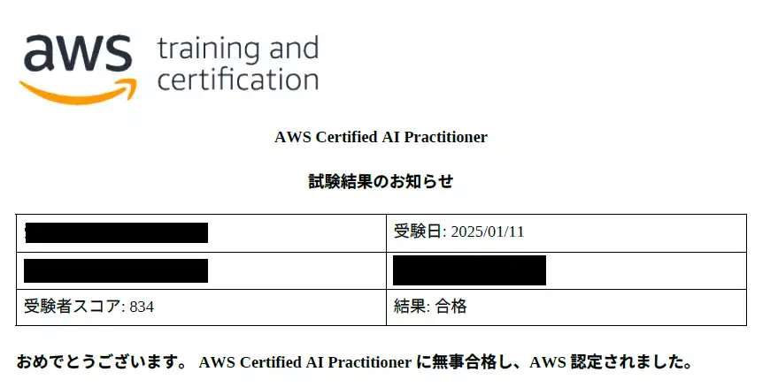

## 概要
なかなか時間取れず1週間遅れの投稿になりましたが、1/11に「AWS Certified AI Practitioner」に合格していました。  

## 勉強方法
まず私のスペックです。  
- AWSは実務経験あり
- AWS認定資格はAIF、MLA、MLS以外取得済み
- AIや機械学習はChatGPTしか知らない

### CloudLicense
他の資格でも利用してたため、CloudLicenseを利用しました。  
私が受験した当時は、#10（70問）しかなかったので、Web問題集を3週ほどしました。  
<ExLinkCard url="https://cloud-license.com/" />

### Udemy
CloudLicenseの問題数が少なかったので、Udemyも購入しました。  
下記の問題集を全て2周しました。  
<ExLinkCard url="https://www.udemy.com/course/aws-certified-ai-practitioner-certification-55-4/" title="AIF-C01 / AWS Certified AI Practitioner 対策テスト4回＋補足問題" />

勉強期間は1週間、1日130～195問くらい解くようにしていました。  

## 感想
Practitionerと言えども、油断してると落ちる。  
特にAIや機械学習の前提知識の少ない人が油断して受けると知らない言葉のオンパレードで悩む予知すらないという状況になりかねないので、最低でも問題集やってAIやら機械学習の知識を詰め込んでいくことをおすすめします。  
最初のインプットには辛いですが、Associateと比べると試験範囲が狭いため、ひたすら繰り返せば1週間くらいでなんとな～く覚えられます。  

2月15日までは再受験無料クーポンが有効ですし、Early Adopterバッジも貰えるので、受験を悩んでいる方は今がチャンスです！！  
<ExLinkCard url="https://pages.awscloud.com/GLOBAL-other-GC-traincert-aws-foundational-certification-2024-learn-jp.html?sc_icampaign=aware_apj_200_certification_foundational-retake_ribbon_jp_tnc&sc_ichannel=ha&sc_icontent=awssm-1949905_aware_tnc&sc_iplace=ribbon&trk=a679091a-b2e8-4893-816d-03214a6b92a4~ha_awssm-1949905_aware_tnc/" />
