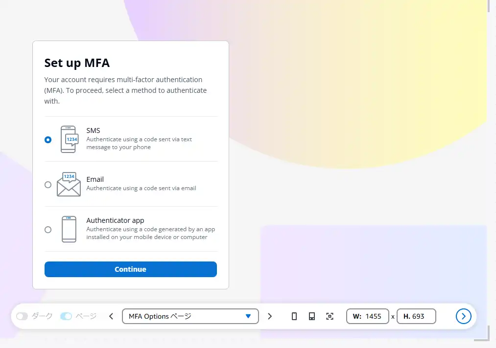
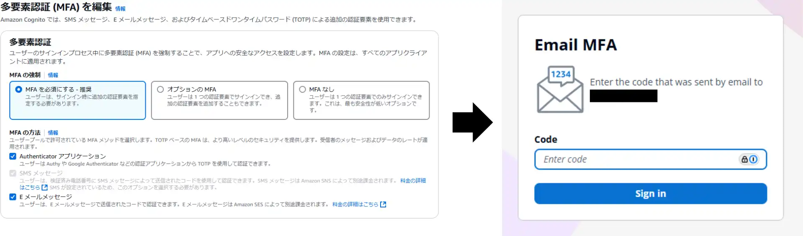
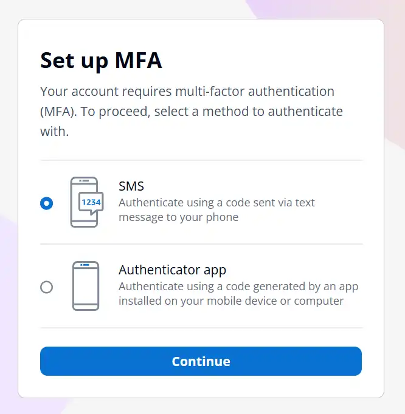
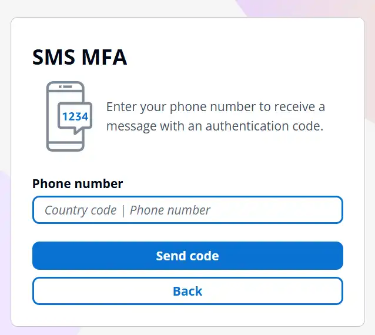
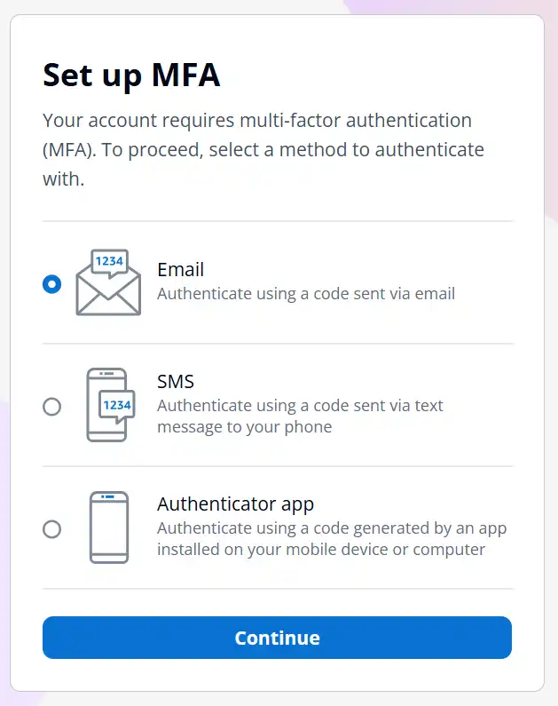
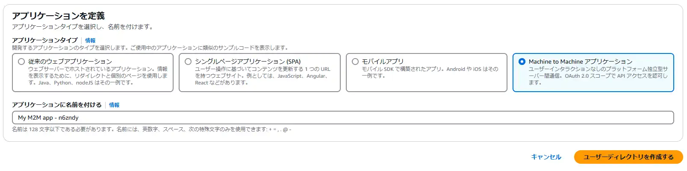
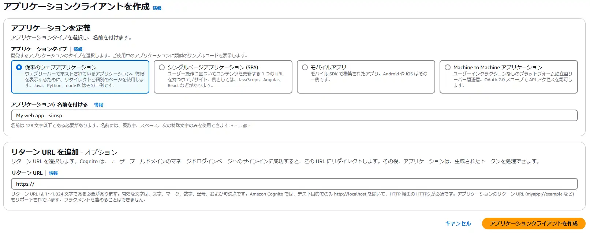
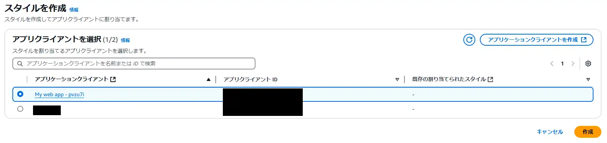
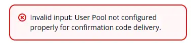

## はじめに
お客様へCognitoの導入を提案する中でMFA方式を選択出来るか否かを調査したので、その備忘録になります。  

MFA方式の選択画面はマネージドログインに用意されているため、何かしら条件を満たせば表示はされそうです。  
  

ただし、MFAの方法にて全て選択しても選択画面は現れないようです。  
  

どうすればMFAを選択出来るようになるのでしょう？  
また、どのような判定がされているのでしょう？  

## MFA方式の判定方法
「MFAの方法」とユーザが持つ「phone_number属性」または、「email属性」で設定されるMFA方法が選択されます。  

まずMFA選択にあたって、最も優先される項目は「MFAの方法」で、有効化されている「MFAの方法」の中から設定されるMFA方式が選択されます。  
次に、ユーザが持つ「phone_number属性」または、「email属性」によってMFA方式が選択されます。  

ややこしいのでパターンで示します。  
前提：「MFAの方法」で「Authenticator アプリケーション」、「SMS メッセージ」、「E メールメッセージ」が選定されている場合  

１．ユーザの「phone_number属性」が設定されおり、「email属性」が設定されていない場合  
→SMSメッセージが使用されます。  

２．ユーザの「email属性」が設定されおり、「phone_number属性」が設定されていない場合  
→E メールメッセージが使用されます。  

３．ユーザの「phone_number属性」と「email属性」が両方設定されている場合  
→SMSメッセージが使用されます。（SMSメッセージの優先度が高いため）  

| 判定順序 | 項目 |
| ---- | ---- |
| 1 | MFA方式  |
| 2 | ユーザ属性(sms>email>authアプリ) |

## ユーザがMFAを選択出来る場面とは？
AWSが上記に沿ってMFA方式を決められない場合、ユーザにMFA選択画面が表示されます。  
具体的に言うと、「MFAの方法」で有効化されていない属性を使用してユーザがログインしている場合です。  

再度パターンで示すと、以下のような動作になります。 

前提：ユーザが「email属性」を使用してログインを行う場合  

１．「MFA方式」で「Authenticator アプリケーション」、「SMS メッセージ」を有効化した場合  
→「Authenticator アプリケーション」、「SMS メッセージ」いずれかのMFA選択画面が表示されます。    
  

２．「MFA方式」で「SMS メッセージ」を有効化した場合  
→「SMS メッセージ」のMFA設定画面が表示されます。    
  

「phone_number属性」を使用してログインする場合も、上記と同じような動作になります。  

## 全てのMFAの方法を有効化した状態で、ユーザにMFAを選択させるには
ユーザが「ユーザ名属性」でログインするようにされていれば、自由にMFA方式を選択されることが出来ます。  
  

### ユーザ名属性だけでログインする方法は？
ユーザープールの作成画面で「ユーザ名」を選択してもメールアドレスまたは電話番号を必須属性に設定する必要があると、怒られてしまいます。  
「ユーザ名属性」のみを使用してログインするには「Machine to Machine アプリケーション」を選択し、ユーザープールを作成します。  
  

その後、アプリケーションクライアントを作成から「従来のウェブアプリケーション」等のクライアントを作成し、マネージドログインから認証画面のスタイルを割り当てます。  
  
  

上記の通り作成することで、メールアドレスや電話番号を必須属性とせずユーザープールを作成出来ます。  

### ユーザ名属性だけで運用する注意点
Cognitoはユーザのサインアップ時に確認コードでアカウントの有効性を確認するのですが、メールアドレスや電話番号が設定されていないため、
確認コードを配信出来ない旨のエラーが発生します。  
  

そのため、MFAを全ての方式から選択させる場合はCognito管理者がユーザ作成画面から個別でユーザ作成する必要があります。  

### 管理者がユーザ登録する場合の注意点
Q）Cognitoの管理者がユーザ作成する方法にCSVインポートがありますが、この方法でMFA方式を自由に選択することは出来るのでしょうか？  
A）出来ません。  

CSVインポートを行う場合は、メールアドレス及び電話番号の登録が必要です。  
詳細については以下のドキュメントを参照ください。  
<ExLinkCard title="CSV ファイルからユーザープールへのユーザーのインポート" url="https://docs.aws.amazon.com/ja_jp/cognito/latest/developerguide/cognito-user-pools-using-import-tool.html#cognito-user-pools-using-import-tool-csv-header" />

## さいごに
CognitoのMFA方式の選択方法を調査してみました。  
誤りがあれば教えてください！！！！！  