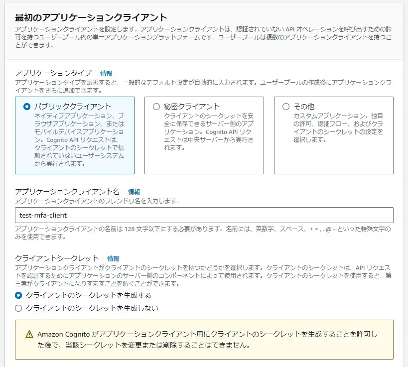

# はじめに
CognitoのMFA認証にEメールが追加されました。  
<ExLinkCard url="https://aws.amazon.com/jp/about-aws/whats-new/2024/09/amazon-cognito-user-pools-email-authentication-option/" />

あまり注目されてませんが、以前まではLambda等を使用して自力実装しかなかったと思うのでかなり熱いアップデートだと思ってます。  
実際にCognitoを使ってメールでMFA認証出来るか動作確認してみましたので備忘録として記事にします。  

## 前提
今回の構築範囲はCognito構築及び、それに関わるSES構築とALBの設定変更です。  
認証をかけるテストサイトは今回作成済みの想定です。  

## SES構築
まずはメール配信に必要なSESを構築していきます。  
テスト目的であっても、CognitoでメールMFAをするためにはSESが必須のようです。  

### IDの設定
まずはIDの設定をします。  
なお、ドメインはCloudflareで取得し、DNSもCloudflareを使用しています。  

IDの作成から認証したいドメインを指定する  

ドメイン検証は以下の通り設定し、IDを作成  

### ドメインの検証
ドメインの検証をするために、DNSレコードの発行に記載されているCNAMEレコードをCloudflare DNSに追加します。  

少し待つとドメインが検証済みになります。  

### FROMドメインの編集
送信元のドメインを編集します。  

同様に、以下のレコードをCloudflareのDNSに追加して認証します。  

こちらも数分待つと検証済みとなります。  

### DMARC設定
Gmailのスパム対策対応もかねて設定していきます。  
DNSレコードを1つ追加するだけです。  

### テストメールを送信してみる
問題なく受信箱に届いているか確認します。  
また、SPF、DKIM、DMARCがPASSになっているか、送信元や署名元ドメイン等も問題ないことを確認します。  

今回SESは本番運用せず、サンドボックスのまま使用しています。  
そのため、テストメールを送信する先のメールアドレスを予め認証状態にしておく必要があります。  
IDの作成からメールアドレスを選択し、テストメールを受信したいご自身のメールアドレスを認証してください。  
（本番リクエストしてみましたが、情報足りなくて審査出来ないよ！と言われました。。）  

## Cognitoの構築
次に本題のCognitoを構築していきます。  

### ユーザプールの作成
ウィザードに沿って作成します。  

Eメールにチェックを入れます。  

パスワードポリシーはデフォルトのまま  

多要素認証とユーザアカウントの復旧は後で設定するため、ここでは「MFAなし」とします。  

セルフサービスのサインアップはデフォルトのまま

属性検証とユーザアカウントの確認もデフォルトのまま

必須の属性も特に指定なし

EメールではSESを選択します。（CognitoでEメールを送信すると、テストであってもMFAメールを送ることは出来ません。）  
送信元のEメールアドレスでは先ほど作成したSESのドメインを選択します。  

また、送信者の名前は必ず入力が必要です。  
オプションと言いつつ、指定しないとエラーになります。  

ユーザプール名は任意です。  
また、認証用UIを作成するのが面倒なため、ホストされたUIを使用することにします。  

認証ページのドメインは任意のドメインを使用してください。

パブリッククライアントを選択し、任意のアプリケーションクライアント名を指定します。  
また、今回はALBで使用するためクライアントシークレットは「生成する」を選択します。  

最後にコールバックURLを指定して作成完了です。
コールバックURLの形式は以下の通りです。  
`https://{認証をかけたいサイトのドメイン}/oauth2/idpresponse`である必要があります。  
今回認証をかけたいサイトは`https://test.sori883.dev`  

## ALBで認証を設定する
### ユーザ作成
まずログイン用のユーザを作成します。Cognitoのユーザプールで適当に作成します。  
このとき入力するメールアドレスはSESで送信可能なメールアドレスを設定する必要があります。    

### ALBのリスナー編集
HTTPSリスナーの編集を開き、Cognitoを使った認証を設定します。  
この時、リスナーはHTTPSである必要があります。  

### ログイン確認
テストサイト（`https://test.sori883.dev`）にアクセスすると以下のサインイン画面が表示されます。  
正常にログインし、テストサイトが表示されれば動作確認はOKです。  

## メールのMFAを設定する
Cognitoのユーザプールから、高度なセキュリティ機能を有効化します。  
EメールでMFAを行うには必須です。  

ユーザアカウントの復旧からメール以外でも復旧出来るように設定します。  
ユーザアカウントの復旧方法がEメールのみの場合、EメールでのMFAは設定できません。  

「MFAを必須にする」を選択し、「Ｅメールメッセージ」を選択し、EメールでのMFAを有効にします。  

## MFAメールの動作確認
先ほどと同様にログインすると、ワンタイムパスワードの入力画面が表示されます。  

また、メールアドレスに下記のようなワンタイムパスワードが配信されます。  
これを、ワンタイムパスワードの入力画面に入力することで、無事ログイン出来ました。  

### 参考
<ExLinkCard url="https://note.com/usutani/n/ncebc0eda63cc" />
