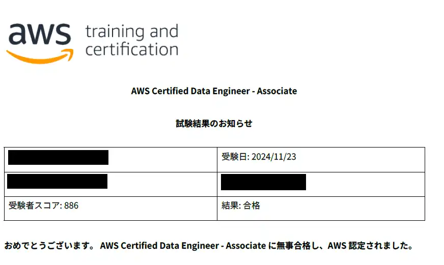

## 概要
2週間前の[AWS SCS合格](https://sori883.dev/posts/aws_scs_c01_passrecord/)に引き続き、「AWS Certified Data Engineer - Associate(DEA-C01)」に合格しました。  
合格体験記として、DEAの所感をまとめます。

## 勉強の流れ
### 勉強時間
DEAから2週間勉強して合格しました。  
勉強時間は平日3時間、休日は5時間程度、総じて40～50時間程度勉強して臨みました。  

### 勉強方法
#### 教材.1 CloudLicense（1週間）
DEAは試験範囲が狭く、CloudLicenseの200問弱を1周→間違えた問題1周→更に間違えた問題を1周しました。  
<ExLinkCard url="https://cloud-license.com/" />

#### 教材.2Udemy（1週間）
CloudLicense3周後に実施し、初回は60％～70％でした。こちらも3周しました。  
[【DEA-C01対応 2024年版】AWS認定 データエンジニア アソシエイト 模擬問題集【2回＋α 計190問】](https://www.udemy.com/course/dea-c01-2024aws/p)  

AWS認定資格はProfessional、Specialtyを取得済みなので余裕だと思ってましたが、
DEAの出題範囲はDevOps、Architectと被っておらず、SCSより難しく感じました。  
ただし、出題範囲自体は狭いので、サービス1つずつを理解すれば余裕で合格ラインに到達できるかと思いました。  

個人的に調べておいて良かったサービスは以下の通りです。  
SCSやSAP等未受験であれば、下記にプラスしてKMSやSecretManager、IAMを軽く押さえておく必要ありです。  
- Redshift、Redshift Spectrum、Athena
  - どのサービスにクエリ出来るのか、クエリ出来るファイル（ファイル変換の要否）
- Glue、DataCatalog、EMR、SageMaker Data Wrangler
  - Glueワークフロー、StepFunctionどちらを使用するか
- 機密情報の検出、編集
  - Macieは検出のみ
  - 編集はDataBrewなど

## 本番試験
本番試験の難易度は、CloudLicenseやUdemyとかなり類似した問題が多数出題されたこともあり簡単に感じました。  
演習問題を暗記するレベルで繰り返せば簡単に受かるかと思います。  

## 完走の感想
本当は1週間で受験する予定でしたが、ETLジョブとGlueジョブの違いもよくわかっておらず、
更にUdemyをやってみたら60%台という状況だったので合わせててリスケして2週間みっちり勉強しました。  
プロフェッショナル、スペシャリティ有資格者だとしても重複してる範囲はあまりないためじっくり勉強した方がよいです。  

次はDVAを目標に..こっちも2週間くらいで取れたらいいなぁ...
