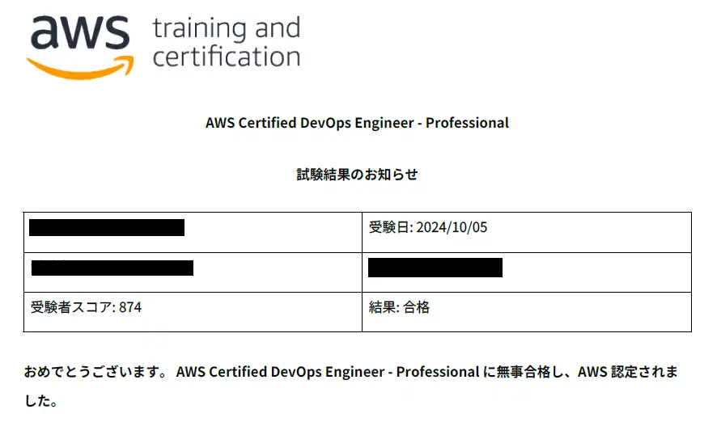
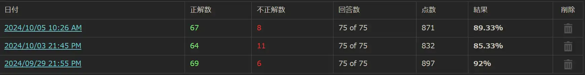

## 概要
[AWS SAPの合格](https://sori883.dev/posts/aws_sap_c02_passrecord/)に引き続き、「AWS Certified DevOps Engineer - Professional(DOP-C02)」に合格していました。  
合格体験記として、DOPの所感をまとめます。  

## AWS経験値

- AWS SAA/SAP取得済み
- AWS実務経験は半年
- オンプレで運用保守・構築を3年

## 勉強の流れ
### 勉強時間
SAP合格した8月12日から勉強を始め、10月5日に受験したので、勉強期間は2か月弱です。  
ただ、お盆とかは旅行してたので、勉強時間は50時間程度です。  

## 勉強方法
### 教材.1 CloudLicense（2か月）
CloudLicenseのみで勉強しました。  
<ExLinkCard url="https://cloud-license.com/" />

勉強内容は、⓵演習問題を一通り解く→②間違えた問題は振り返り→③間違えた問題だけを再度解く→⓵に戻るをひたすら繰り返しました。  
また、試験２週間前からは模擬試験を解いて間違えた問題だけ復習するを繰り返し行ってました。  
受験直前の点数は以下の通りで、おおよそ本番と同じくらいでした。  

AWS DOPは問題集の数が少なく、DOPに特化した参考書もないです。更にAWS SAPで出てきたサービスの深堀って感じなので、SAP合格後の受験をおすすめします。   
AWS SAPを先に取得したおかげで、勉強の立ち上げがかなりスムーズで、全体の50%くらいはSAPの知識だけで解答出来てました。  
また、SAPの知識があれば、問題文を読んだだけで各サービスの概要や連携を理解できるので、その点もDOP対象サービスの勉強だけに集中出来た要因でした。  

## 本番試験
難易度自体はCloudLicenseとほぼ同じレベルでした。ただ、SAPと比べて同じ問題がかなり少なかったです。  
おそらくDOPは受験者需要が少なく、問題集提供側もあまり力入れてないから精度が低いんじゃないかな？と思います。  

初見問題やCloudLicenseの問題を強化した問題が多いので、問題文を覚えるだけでなく、各サービスの機能やユースケースを理解する必要があります。  
特にCFn、コード4兄弟、デプロイ方式周りは頻出だったので、確実に解けるようにしないと臨む必要があるかと思います。  

## 完走の感想
本番試験で見たことある問題が少なかったこともあり、SAPより自信がなかったです.....が、なんとか一発合格出来ました～～
どう考えても初見でやる資格じゃないのですし、DOPだけ取る旨味もない気がするのでSAP取得→DOPの流れで受験して正解だったかもです。    
