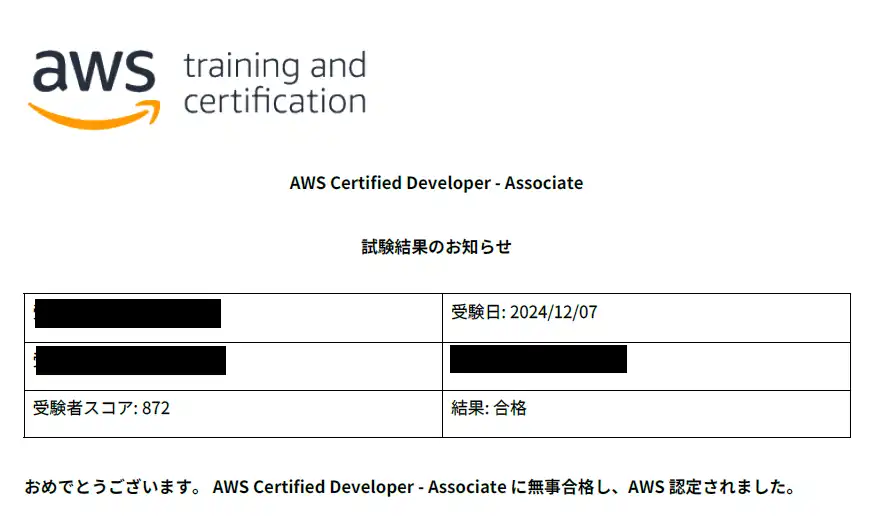

## 概要
2週間前の[AWS DEA合格](https://sori883.dev/posts/aws_dea_c01_passrecord/)に引き続き、「AWS Certified Developer - Associate(DVA-C02)」に合格しました。  
合格体験記として、DVAの所感をまとめます。

## 勉強の流れ
### 勉強時間
勉強時間は約30時間、期間としては2週間で試験に臨みました。  

### 勉強方法
#### 教材.1 CloudLicense（2週間）
1週間程度かけてCloudLicenseを1周→2周目は間違えた問題だけ再度解きなおしを行い、
2週間目は1日1回本番試験モード→間違えた問題だけ復習をするのサイクルをひたすら繰り返しました。  
<ExLinkCard url="https://cloud-license.com/" />  

因みに、Udemy教材も購入して解いてみたのですが、CloudLicenseと問われる範囲？深さ？がかなり違っていて、CloudLicenseなら900取れるのに、Udemyだと600点しか取れず、
メンタルブレイクしたのこちらは早々に解くのをやめました。  
不安な方はUdemyまで解くと安泰なのでしょうが、CloudLicenseを中心的でも試験対策としては十分でした。  

特に、メインどころを覚えておくと分からない問題でも消去法で正解出来るので、下記とかはちゃんと抑えておいた方がよさげです。    
- Lambdaの概要、DynamoDBやAPI GWとの連携
- CloudFormation(SAM)
- DynamoDB、Dynamo Stream
- Secret Manager、System Manager Parameter Storeの違い

## 本番試験
試験については、CloudLicenseで出題範囲のサービスを押さえていれば問題ないレベルかなーと思いました。  
それでも見直しフラグ20個くらいつけましたけど。  

## 完走の感想
AWS認定取り続けてるので、受かっててもあまり嬉しい！！ってならなくなりました（慣れってこわい）  

今私ITな会社に勤めているんですが、受験料は全部自腹で、報奨金とかもありません。  
試験料負担、報奨金支給制度自体はあるんですけど、AWSは対象外なのです。  
私がSAPを勉強し始めるにあたってAWSも対象とすると、とても偉い方から口頭でお話貰ってたんですが、かれこれ6か月くらい経って未だ対象となっていないんですよね。  
前回お話したときは全社的な会議で周知するから待っててなんて言われてるんですが、本当に貰えるんでしょうか...ドキドキです。  
割引クーポン使ってるにせよ10万以上使ってますからね。    
