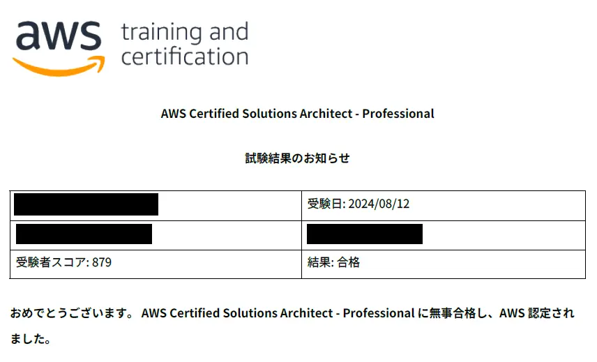
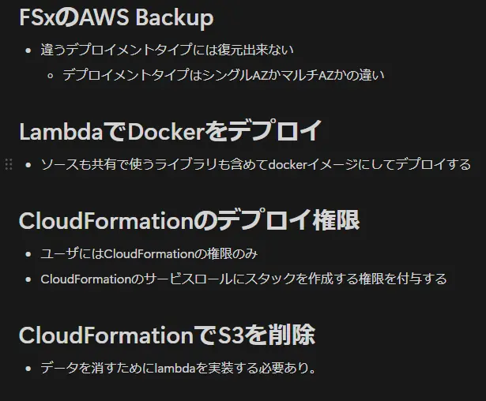
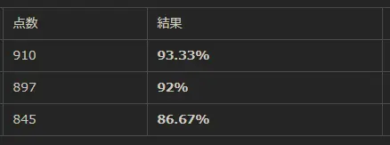
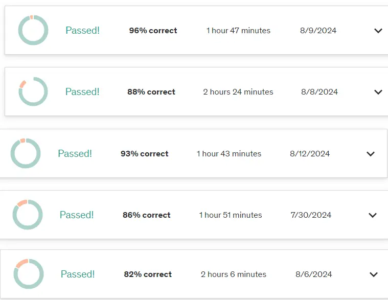

## 概要
AWS最難関と言われる「AWS Certified Solutions Architect - Professional(SAP-C02)」に一発合格しました。  
この記事では、AWS SAPを受ける方に少しでも役に立てればと思い、合格記として勉強資材や当日の流れをまとめます。  

## 受験目的と業務経験値
今年度からAWSの構築案件に従事することとなったため、箔をつける目的で受験しました。  
また、会社からそれなりの報奨金が貰えることも目的（モチベーション）の一つです。    

私がAWS SAPを受験した時の業務経験値は以下の通りで、AWSがちょっと分かる状態でした。

- 2022年に趣味でAWS SAA取得済み
- AWSのちゃんとした業務経験は4か月程度
  - それ以外はアプリの検証目的でEC2やRDSを作った程度
- オンプレで運用保守・構築を3年

## 勉強の流れ
### 勉強時間
受験を決意したのは6月3日、受験日は8月12日なので、約2.5か月を勉強に費やしました。  
期間だけ見れば長く感じますが、6月と8月の勉強強度は雲泥の差ですし、
この2.5か月間にブログ（https://sori883.dev）をNext.jsからHonoXに作り変えたりしているので、
純粋な勉強時間は100時間程度です。

### 勉強方法
使用した教材は下記の3つです。

#### 教材1．参考書（1週間）
Amazonで「AWS SAP 参考書」と検索して一番上の参考書を購入しました。  
[「AWS認定資格試験テキスト＆問題集　AWS認定ソリューションアーキテクト - プロフェッショナル　改訂第2版」](https://amzn.asia/d/bCqmWzc)  

この参考書に書いてある内容は、AWS SAPに出題されるサービスの概要と、その模擬問題集です。  
SAPではAWS各サービスの概要ではなく、複数あるユースケースの中から要件に合わせた最適解を問われる問題がほとんどであるため、この参考書を読んでも問題が解けるレベルには達しませんでした。  
そのため、AWSにはサービスがあるんだな～と雰囲気つかむ程度にサクッと流し読みしました。  

#### 教材2．CloudLicense（2.4か月）
600問近い演習問題と本番を想定した模擬試験が行えるサイトです。  
AWS SAPの演習問題を解くには5000円弱/3か月のサブスクをする必要あり。  
会社の資格保有者はほぼこのサイトを利用しており、私自身もほぼこのサイトのお陰で合格出来ているため、一番おすすめの教材です。    
<ExLinkCard url="https://cloud-license.com/" />

演習問題の#01～#83まで3週間程度で1周し、その後受けた模擬試験の点数を参考程度に記載します。  
- 点数: 741 点
- 正解率: 76%

合格ラインに達していますが、受験料4万を支払うにはまだまだ安心出来る正解率ではなかったため、演習問題を再度#01～＃83まで実施しました。  
一度目に間違えた問題は「お気に入り１」に登録、次に「お気に入り１」の問題だけ解く、また間違えた問題を「お気に入り２」に登録...と繰り返し最終的に演習問題を4周し、
問題を解くより間違えた問題を確実に復習することを心がけ、Notionにキーワードベースで下記のようなメモを大量に取りました。（なお見返してはいない模様）  

実施内容
- 演習問題#01～#81を約5周
- 模擬試験を5回

#### 教材3．udemy（1か月）
本試験を想定した問題集（75問）を5セット＋30問のおまけが3000円弱で行える教材です。  
こちらも会社で利用している社員が多かったので購入してみました。  
<ExLinkCard url="https://www.udemy.com/course/sap-c02aws-2024/" />

CloudLicenseと同時並行で実施していましたが、CloudLicenseよりも少し難しく感じ、最初の1週目はかなり苦しかった記憶があります。   
せっかく購入したので、1周する→間違えた問題を徹底的に復習しました。  

実施内容
- 問題集（75問）5セットを2～3週
- おまけの30問を1周

#### 一番点数が伸びた勉強方法
CloudLicense、udemy共通して、間違えた問題の解説を読む→Notionにキーワードだけ適当にまとめる→数日後にもう一回問題を解くの王道ループが一番知識の定着に繋がりました。    
特に危機感を感じ始めた8月以降の伸びがすごくて、模擬試験（75問）を解く→復習する→寝る→朝起きて模擬試験やり始めるを2週間繰り返したところ、正解率が80％前後から90％以上まで伸びました。  
1回で3時間も時間取れないよ！という人でも、udemyであれば一時停止機能があるため、隙間時間に勉強できます！

## 試験当日
### テストセンターの仕様
私はテストセンターで受験しました。テストセンターごとに差異がある可能性もありますが、留意点としては下記です。  
- 身分証は2つ必要（運転免許証＋マイナンバーなど）
- 試験時間15分前までに到着する必要あり
- 私物の持ち込みは眼鏡のみ
  - ティッシュ（2枚）、耳栓はテストセンターから配布
- トイレ等の途中退出可能、ただし途中退出している間も試験時間は経過する
  - 再入場時にセキュリティチェックあり。（係員曰く5分程度）

### 本番試験内容
難易度自体はCloudLicense、udemyと同じレベルでした。  
CloudLicense、udemyどちらかで見たことある問題が数問出題されました。  

問題内訳（参考程度）
- 限りなく同じ問題：1割程度
- 完全初見問題：1割未満
- 類似問題：8割強

## 試験後の合格発表
他の合格体験記を見る限り、15時以前は当日の21時頃、15時以降は翌日4時頃に結果通知が来るみたいです。  
私は13時30分～16時30分枠で受験し、翌日3時15分にcredlyからバッジ獲得通知、11時11分にAWSからスコアボードが届きました。    
（私は4万円の圧から寝付けず、徹夜で合格通知を待ってました笑）

## 受験目安
これは他の体験記を読んで気になっていた部分ですが、受験料が高額なため、慎重な方は模擬試験の結果見合いで予約する方もいらっしゃるかと思います（私もそのタイプ）  
参考程度に私のCloudLicenseとudemyの点数を掲載しますので、ご自身の予約判断に活用いただければと思います。  

***CloudLicense***  

***udemy***

初見問題を考慮すると、本番試験では模擬試験からマイナス50点位が最高点だと考えると安牌かもしれませんね。  

## 完走の感想
合格した時、一番嬉しかったことが「もう勉強しなくていいんだ！！やったーーーー！！」でした。  
最低3時間、機械翻訳されたであろう長文を読み、答え、復習する毎日で最高に辛かったですが、合格した時はとてつもない達成感があり、酒がマジで旨かった。  

この苦痛への耐性が消える前に、もう一方のプロフェッショナル資格であるDOPを取得目指して勉強を始めました。1か月くらいで取れたらいいなぁ。  
