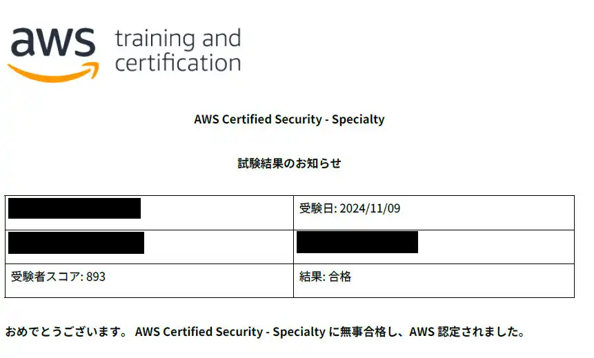
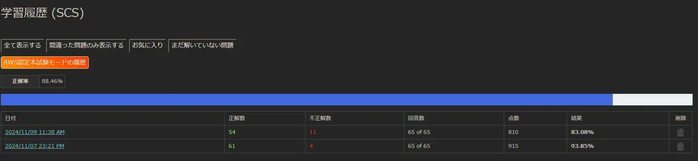

## 概要
[AWS ANSの合格](https://sori883.dev/posts/aws_ans_c02_passrecord/)から3週間後、「AWS Certified Security - Specialty(SCS-C02)」に合格しました。  
合格体験記として、SCSの所感をまとめます。  

## 勉強の流れ
### 勉強時間
教材.1 CloudLicense（2週間）
会社の有資格者から「SCSはめっちゃ簡単だから余裕だよ」とありがたい(?)助言頂いたので、2週間で取得を目指し、CloudLicenseだけに絞って勉強しました。  
<ExLinkCard url="https://cloud-license.com/" />

勉強の内容は、⓵演習問題を1周する→②不正解だけ再度解きなおす→③再度不正解だけ解きなおす→模擬試験を2回実施。  
模擬試験の結果は下記の通り。  
1回目で93％取って余裕じゃん＾＾と思ってたら、試験当日の模擬試験で正解率83%を叩き出しメンタルブレイクしました()  

結果自体は合格ですが、模擬試験で詰め切れていない点もですが、正解出来てる問題でも自信がない問題が多々あったため、
準備期間としては少し不足していたと感じていました。  
SAP未取得であればおよそ1か月くらいが目安なんじゃないかなぁと思います。    
個人的に、SAPやDOPの知識で解けるor選択肢を絞れる問題が多数出題されたことが要因で2週間で合格出来たと思ってます。  

## 本番試験
試験時間1時間を残して終了しました。  
問題の内訳は、他資格の知識で選択肢を絞れる問題 > CloudLicenseで解ける問題 > 他資格の知識で解ける問題でした。  
個人的には、KMSやS3周りのポリシーとIAMポリシーを結び付けた問題がすごい苦手で、試験前に重点的に対策しておいてほんとによかったです(;-;)  

## 完走の感想
毎回、絶対落ちたじゃん...と思うくらい手応えを感じないのですが、スコアレポートを見ると予想以上に高い点数で合格しており、試験後は情緒不安定になります。  

気になってることがあって、今回から試験結果のお知らせPDFにスコアレポートが記載されていないんですけど、やめちゃったんですかね？  
10月26時点、CloudLicenseの合格記にはコンピテンシーを満たしているかが記載されているので、
SCSであってもスコアレポート提供されるはずなんですけど、私のPDFには記載ありませんでした。  
これでAWSを突いて面倒なことになるのも嫌なのでどなたかAWS凸お願いします。  

次はアソシエイトを取得していこうと思います。手始めに、DEAを目指します。  
問題集も少ないですし、1週間後に予約を入れてサクッと取得しようと思います。  
機械学習とかAIとかなんも分からんので、機械学習3資格はまとめて受けた方が効率よさそうなので後回し。  
