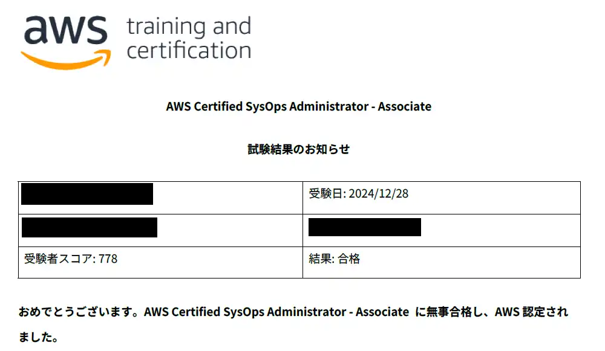
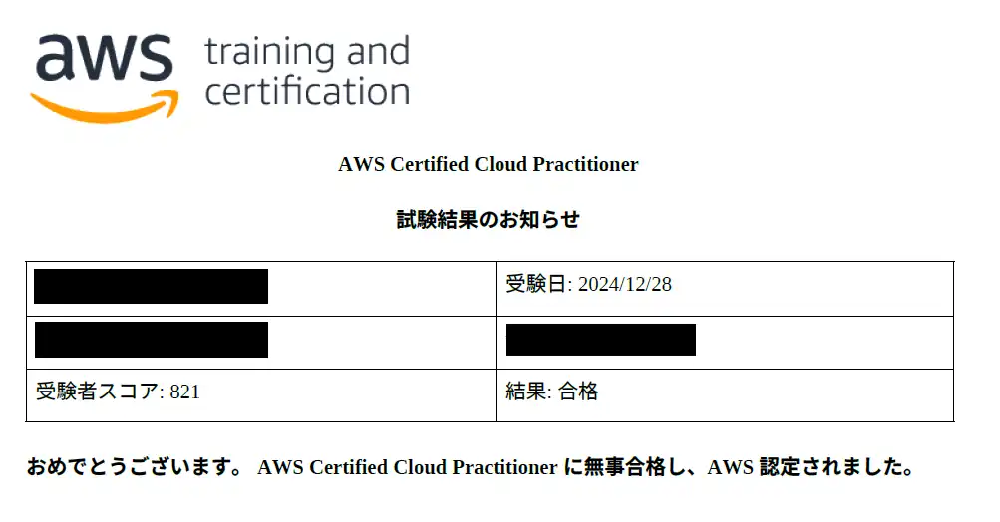

## 概要
12/28にAWS SOAとAWS CLFを2つ連続で受験して合格しました。  

私自身、上位資格取得済みで受かって当たり前の状況ではありますが、同時受験される志高めの方向けに、同時受験の極意()を備忘録に書き留めさせていただきます。  

  
  

因みに同時受験した動機としては、SOA2週間でCloudLicenseの模擬試験90%取れて余裕かましてた＋前倒ししようにも試験会場に空きがなかった＝CLFも一緒に受験しちゃうか！って流れでした。  

## 勉強内容
### 勉強期間
12/8から勉強開始し、12/28受験なので全体としては3週間程度勉強しました。  
2週間目まではCloudLicenseでSOAの模擬問題、模擬試験を繰り返す。  
残り1週間はCloudLicenseでCLFの問題集とSOA模擬試験を同時に実施。  
CLFに費やした時間はおおよそ3日くらいです。  

### 同時受験ゆえの辛み
メリットは全冠までの期間を縮められること、勉強面のメリットはないです。  

また、覚えたことは学習後1時間で約50%、24時間後には約70%と言われいるとおり、CLFをやってる間にSOAが抜け、SOAやってる間にCLFが抜けます。  
その証拠に、試験3日前に勉強やめたSOAで初めて700点台での合格となりました。  
今回は短期間のため問題にはなりませんでしたが、１か月単位であれば確実に破綻していたと思います。  

全冠を急いでるとか特殊な事情がない限り、絶対に1個ずつ確実に受けたほうがいいです。    
CLFですら試験料1万超えるので冷静になった方が良い。  

## テストセンターでの手続き
同時受験の手続きどうなるの？って感じかと思いますが、私のテストセンターでは私の希望を汲んで対応してくれました。  

- CLFを通常通り受付→30分位で終了して退出。
- 受付の人に「このまま続けてやりますか？時間通りにやりますか？」と打診されました。
  - 続けてやる場合はコンビニとトイレはOK、ロッカーもそのまま←今回はこっち
  - 時間通りにやる場合はロッカーキー返却して再入場
- コンビニ行った後、またSOAの受付（写真撮影とか）
  - 説明とかは全部スキップ、サイン、写真撮影、セキュリティチェック等のみ実施。  

2連続だったので試験時間だけで1.5時間、疲労困憊です。  
CLFは試験終了時点で合否が表示されるので、まだモチベ上がりますけど、これが不合格だとか結果分からないだと余計メンタル終わるな～なんて考えてました。  

## あとがき
モンハン発売日までに12冠達成出来ように2個一気に受けましたが、普通に1個ずつ受けます！！！  
しかも前日は忘年会で滅茶苦茶アルコール接種して二日酔い気味だったので満身創痍状態で1.5時間が永遠に感じられました。もう二度と酒飲み後に資格試験なんてやらない..  

残すところAIF、MLA、MLSの3つ。絶対にモンハン発売までに終わらせてモンハン楽しみたい。  
