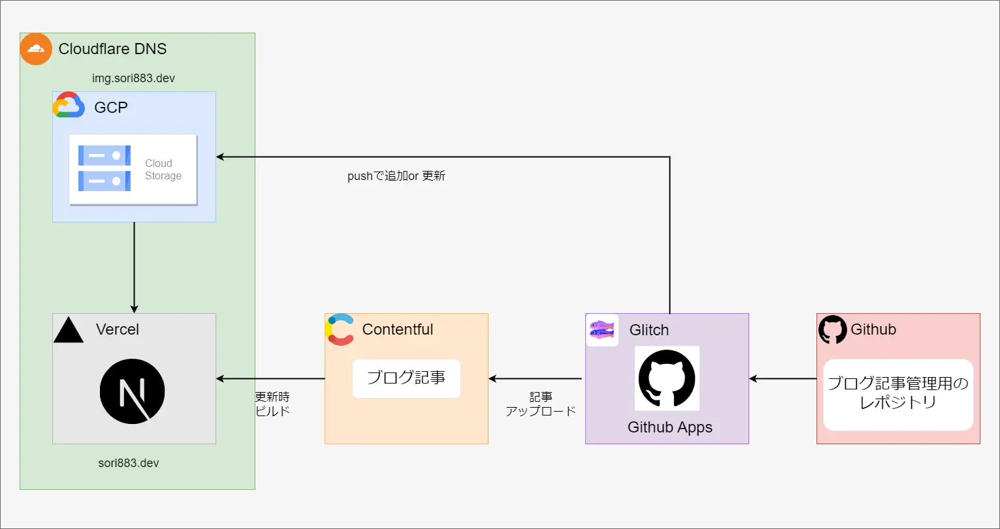
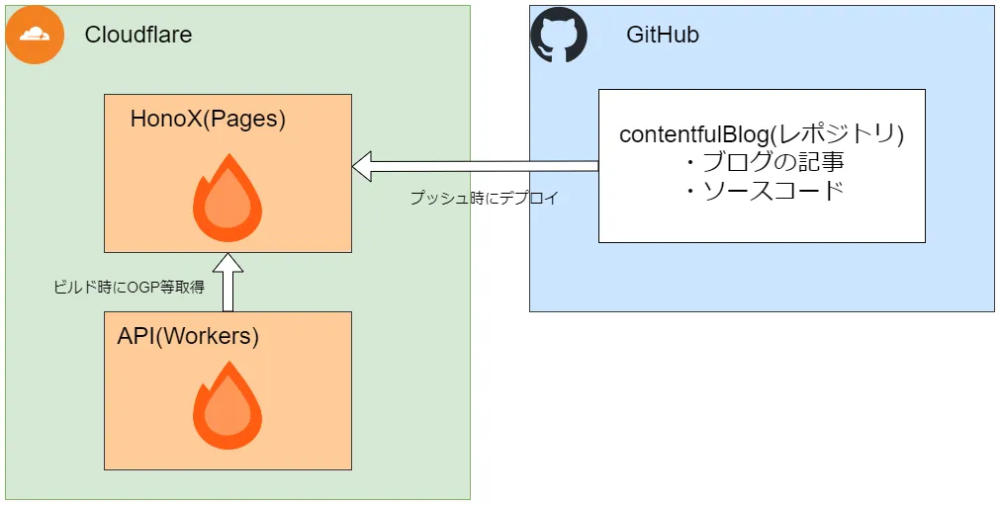

## 作り変えの背景
このブログは2022年にNext.js、ContentfulとGithub Appをメインに据えた構成で構築していましたが、
ほぼ1からHonoXに作り変えしました。  
初回構築時のテンションはこの記事に記載してます。  
<ExLinkCard url="https://sori883.dev/posts/this_blog_architecture/" />

### 運用管理が煩雑にすぎた
2022年に構築した時のアーキテクチャを以下に載せますが、GitHubのレポジトリが4つ、デプロイしているアプリが3つ、DNSなど利用しているサービスが5つ
もあり、記事投稿以外の運用管理にかなりの工数がかかっていました。 

特に記事投稿の要となっているGitHub Appにはかなり苦戦を強いられており、
内部で使用しているContentful APIの文献が少ないうえに、Prismaのupsert処理等を自前で実装しています。  
さらに、Glitchへのデプロイ手順を手動メインで行っていたため、再デプロイ時に度々エラーが発生し、気軽に更新するのも怖い状況でした。  

また、GitHub App以外もメンテナンスしていくうえで同様の事象に見舞われる可能性があったため、
より簡単にブログの運用管理が行えるよう、更改することにしました。  

### 反省点
最大の反省点は、運用フェーズを考慮せず開発フェーズのモチベーションで「プログラム書くの好きだし、モチベーションあるから余裕でしょ！」と高を括っていた点だと考えています。  
どう考えてもモチベーションなんて一過性で、仕事して、他の触りたい技術も出てくる、
資格も取りたい、酒飲んで遊びたいなかで記事を書いて、プログラムも修正して（しかもユーザには見えない改修）なんて続くわけないんです。  

現に成果物として下記4つのレポジトリを作成しましたが、現行使用しているcontentfulBlog以外、
製造以降モチベーションが急降下してほぼコミット出来てません。  
1. https://github.com/sori883/contentfulBlog
1. https://github.com/sori883/blogContent
1. https://github.com/sori883/contentfulBlogOgImage
1. https://github.com/sori883/conetentfulBlogApps

当時はまだ自分で個人開発したサイトを運用した経験がなかったため、このような結果になったと考えています。  

## 作り変え方針
第一の目標は「運用管理が簡素に行えるように作り変える」です。  
そのためにまずは、下記要件を設けました。    
- GitHubレポジトリは1つにする
- デプロイ先は1つにする

そのうえで個人ブログをするにあたって絶対譲れない下記要件に当てはまるよう様、技術選定しました。   
1. 記事がMarkdownで書けること
1. 記事がGitHubで管理できること

作り変え前のブログはこれらを実装するために、GitHub Appを実装したワケです。  

### 技術選定
結論として、以下を使用しています。  
- Cloudflare
- HonoX
  - SSGで各ページを生成し、Cloudflare Pagesにデプロイ
- Hono
  - OGP取得等の一部機能はCloudflare Workersにデプロイ

選定順はCloudflare→HonoX→Hono。  

#### Cloudflare
Cloudflareは元々DNSを利用していたため第一候補と考えていました。  
また、商用利用などの制約が少なく、利用料金も発生しないため選定しました。  

#### HonoX
HonoXを採用した理由としては、Cloudflareにデプロイが簡単な点と、Viteと組み合わせることで簡単にSSGやMDXが簡単に利用出来る点が今回のケースにマッチしていると感じてそのまま採用しました。  

#### Hono
HTMLRewriterを使用してOGP情報を取得する部分と、MDXをパースしたHTMLから目次生成する部分だけ
Honoに切り出しています。  
HonoXを採用しており、別のフレームワークを採用するメリットも薄いため、そのまま採用しました。  
後の拡充も考えてapiパッケージとしてモノレポ管理し、Cloudflare Workersにデプロイしています。 

長期運営する中でネックとなるのがCloudflare Pagesのアップロード上限くらいかなと思っていますが、現時点でかなり余裕あるため問題ないと判断しました。  
<ExLinkCard url="https://developers.cloudflare.com/pages/platform/limits/" />

## 作り変えた後
最終的な構成は下記の通り、かなりすっきりしました。  
シンプルにしたことでユーザに見えない部分をチマチマ改修する工数を削減し、サイトのデザインといったユーザ体験を向上する部分に注力しつつ、
記事を投稿することも簡単になりました。  

### Honoを採用してみて
ドキュメントと公式サンプルを読むだけでスルッと入ってきて使えるようになるそのシンプルさと、開発体験の良さがとても気に入りました。
- 特別なお作法が少なくシンプルなので、学習コストが低い
- ViteのおかげでHML、ビルドがめっちゃ早い。
- Hono RPCを使うと簡単に型補完される

IslandsアーキテクチャやBYOR等を使うことはありませんでしたが、機会があれば今後のHonoやHonoXの動向見て部分的に
採用していきたいと思っています。  
上記に関連して、今回はお問い合わせフォームを作ろうとしたときに、HonoXではこれ！といったフォームライブラリがまだ確立していない様で
お問い合わせフォーム作成は見合わせました。（必須でもないですし。）  

また、Honoはマルチランタイムをうたっており、将来的にCloudflareから別のホスティングサービスに
乗り換える必要が出たときの改修工数が少なく済むんじゃないかなぁなんて期待しています。  

リスクとしては、HonoXはまだアルファステージであるため破壊的変更に悩まされる可能性があります。  
しかし、それ以上に開発者体験向上によるメリットのほうが大きいと考えていて、
破壊的変更を考慮して機能を絞って改修出来る範囲で作成したため問題ないと思っています。  

## 最後に
個人的な不満も改善したことですし、吐き出しの場として少しずつポエムだとかを投稿していきたいと思います。  
細く長く、どうぞよろしくお願いいたします。

## 参考
<ExLinkCard url="https://zenn.dev/yusukebe/articles/724940fa3f2450" />
<ExLinkCard url="https://blog.p1ass.com/posts/migrate-to-hono/" />
