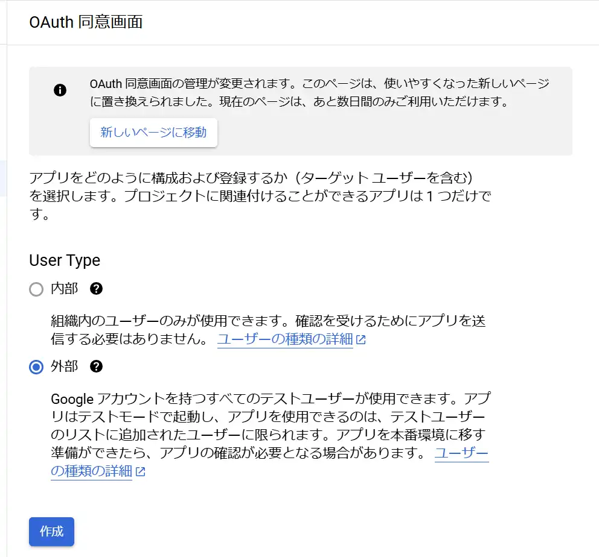
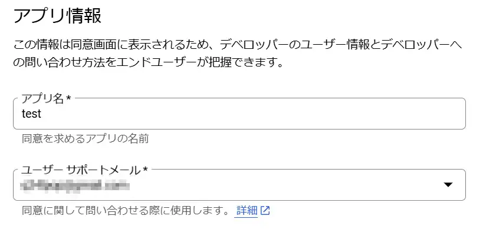
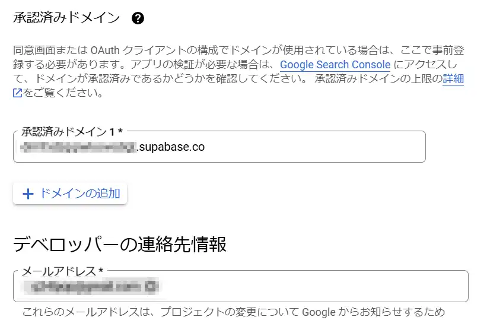
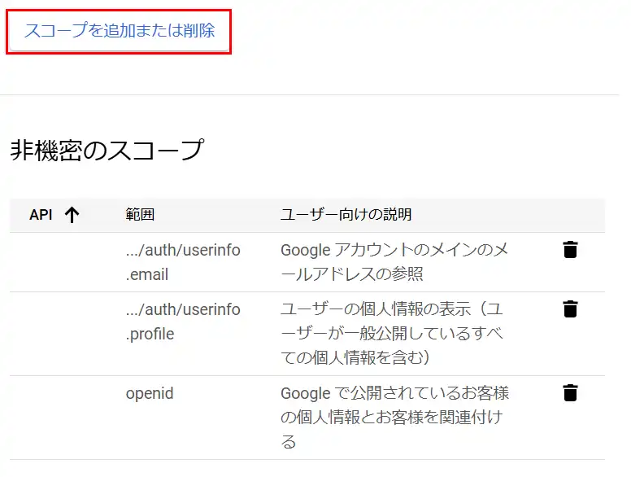
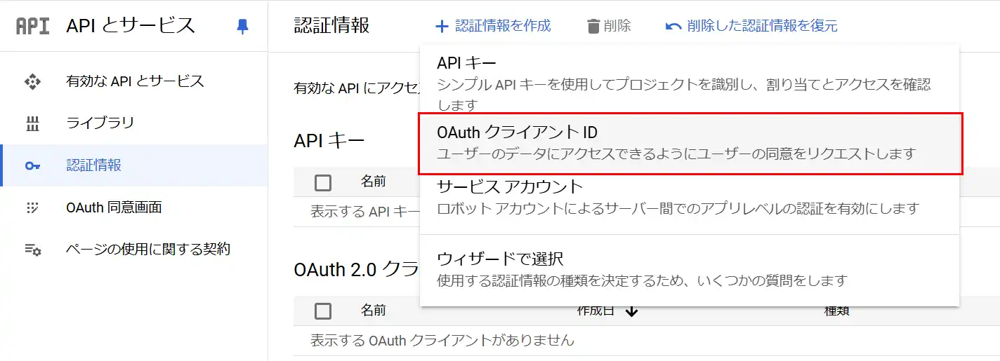
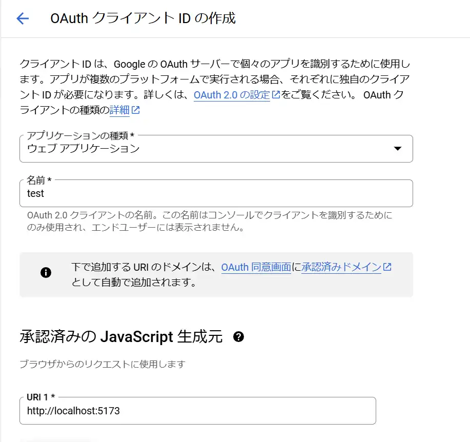
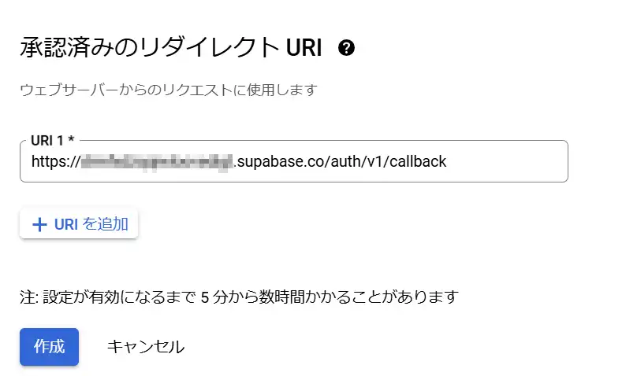
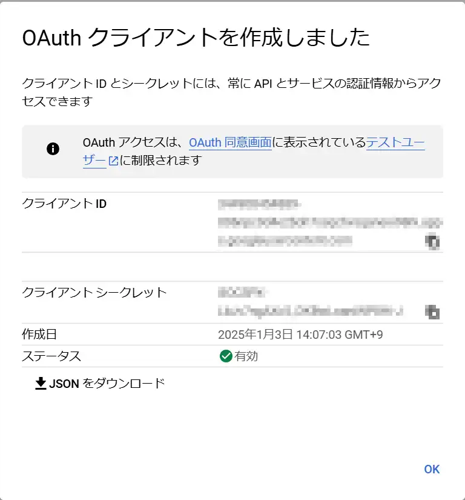
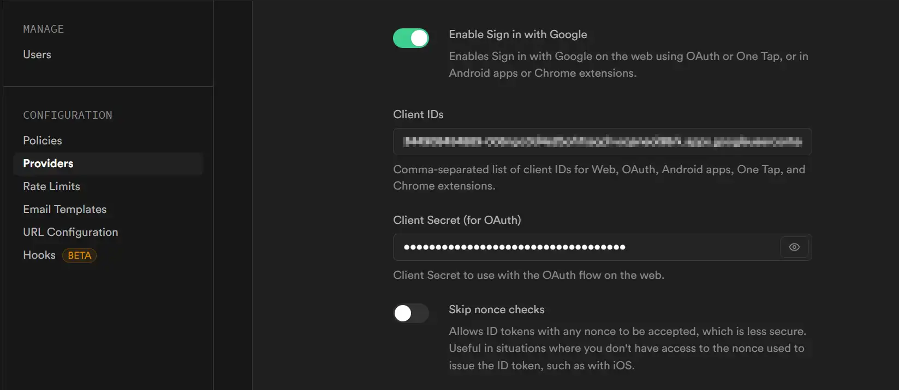

## はじめに
@supabase/ssrを用いて、SSRでのSupabase認証が出来るようになったため、設定手順を備忘録的に残します。  

前提として、Google CloudとSupabaseのプロジェクトは作成済みの想定です。  
また、今回利用するパッケージのバージョンは以下の通りとなり、@supabase/ssrは現時点でBataである点にご注意ください。    
| パッケージ | バージョン |
| ---- | ---- |
| @supabase/ssr | 0.5.2 |
| @supabase/supabase-js | 2.47.10 |

GitHubレポジトリはこちらです！  
<ExLinkCard url="https://github.com/sori883/remix_auth_with_supabasessr" />  

※この記事は下記スクラップの内容をブログに起こしたものです。  
<ExLinkCard url="https://zenn.dev/sorinaji/scraps/53d2ab1a57e3ae" />  


## Remixプロジェクトの作成
今回はCloudflare公式のRemix on Cloudflare Workersのテンプレートに導入していきます。  
<ExLinkCard url="https://developers.cloudflare.com/workers/frameworks/framework-guides/remix/" />  

テンプレートを使用してRemixプロジェクトを作成します。  

```
pnpm create cloudflare@latest remix-supabasessr --framework=remix --experimental
```

テンプレート作成後、必要なパッケージを追加しておきます。  

```
pnpm add @supabase/ssr @supabase/supabase-js
```

そして、.dev.varsにSupabaseで使用する環境変数を記載します。  
Suapabseの環境変数はProject Setting > APIに記載されています。  

```
SUPABASE_URL=https://<project_id>.supabase.co
SUPABASE_ANON_KEY=your_anon_key
```

## Google Cloudの設定
以下リンク先の手順をなぞる形になるため、本記事では変更部分だけピックアップします。  
<ExLinkCard url="https://supabase.com/docs/guides/auth/social-login/auth-google?queryGroups=environment&environment=server&queryGroups=framework&framework=remix&queryGroups=platform&platform=web#application-code-configuration" />  

### OAuth同意画面の設定
まずは[OAuth同意画面](https://console.cloud.google.com/apis/credentials/consent)を作成します。  
OAuth同意画面にアクセスし、`UserType`を`外部`とし、「作成」ボタンをクリックします。  
  

アプリ名とユーザサポートメールアドレスは適当に
  

認証済みドメインは環境変数に設定した`SUPABASE_URL`のドメイン部分だけを入力します。  
  

次の画面では「スコープの追加または削除」ボタンをクリックして画像の通り追加します。  
下記を設定した後は全てデフォルトのままボタンポチポチでOKです。  
  

### OAuthクライアントIDの作成
次にOAuthクライアントIDを作成します。  
[認証情報](https://console.cloud.google.com/apis/credentials)画面から、「認証情報を作成」「OAuthクライアントID」の順にクリックします。  
  

OAuthクライアントIDの作成で、下記画像のとおり設定します。  
URIはRemixの設定に応じて変更してください。  
  

最後に承認済みリダイレクトですが、Supabaseから取得した値を入力します。  
記載場所は「Authentication」>「Auth Providers」>「Google」の中にある「Callback URL (for OAuth)」に記載されています。  
  

クライアントID作成が完了すると「クライアントID」と「クライアントシークレット」が発行されます。  
これをSupabaseに設定していきます。  
  

## Supabaseの設定
Supabaseダッシュボードから「Authentication」>「Auth Providers」>「Google」を開き、クライアントIDとクライアントシークレットを設定します。  
「Save」ボタンクリック後、GoogleがEnableとなっていれば設定完了です。  
  

## RemixでGoogle認証をする
### 認証処理の作成
まずは、RemixでSupabaseを利用するためのSupabase Clientを作成します。  
こちらは、ほぼ[Supabaseドキュメント](https://supabase.com/docs/guides/auth/server-side/creating-a-client?queryGroups=framework&framework=remix&queryGroups=package-manager&package-manager=pnpm&queryGroups=environment&environment=remix-component#create-a-client)の例をそのまま使っています。  

```
export function createSupabaseServerClient(request: Request, c:AppLoadContext) {
  const headers = new Headers();

  const client = createServerClient(
      c.cloudflare.env.SUPABASE_URL,
      c.cloudflare.env.SUPABASE_ANON_KEY,
    {
      cookies: {
        getAll() {
          return parseCookieHeader(request.headers.get("Cookie") ?? "");
        },
        setAll(cookiesToSet) {
          for (const cookie of cookiesToSet) {
            const { name, value, options } = cookie;
            headers.append(
            "Set-Cookie",
            serializeCookieHeader(name, value, options),
            );
          }
        },
      },
      cookieOptions: {
        httpOnly: true,
        secure: true,
      },
  });

  return { 
    client,
    headers,
  };
}
```

次にSupabase Clientを使用したログインやログアウトを実装します。  
`supabase/supabase.server.ts`を作成し、以下のとおり記載します。  

注意点として`successRedirectPath`は後述するコールバック先に合わせておく必要があります。 

```
export const signInWithGoogle = async (
  request: Request,
  c: AppLoadContext,
  successRedirectPath: string = "http://localhost:5173/auth/callback",
) => {
  const supabase = createSupabaseServerClient(request, c);
  const { data, error } = await supabase.client.auth.signInWithOAuth({
    provider: "google",
    options: {
      redirectTo: successRedirectPath,
    },
  });

  return { 
    ok: !error && data ? true : false,
    data: data,
    error: error && !data ? error.message : "",
    headers: supabase.headers,
  };
};

export const signOut = async (
  request: Request,
  c: AppLoadContext,
  successRedirectPath: string = "/",
) => {
  const supabase = createSupabaseServerClient(request, c);
  const { error } = await supabase.client.auth.signOut();

  return { 
    ok: !error ? true : false,
    data: { url: successRedirectPath }, 
    error: error ? error.message : "",
    headers: supabase.headers,
  };

};

export const getUser = async (
  request: Request,
  c: AppLoadContext,
) => {
  const supabase = createSupabaseServerClient(request, c);

  const {
    data: { session },
  } = await supabase.client.auth.getSession();

  return session?.user ?? null;
};

export const isUserLoggedIn = async (
  request: Request,
  c: AppLoadContext,
) => {
  const supabase = createSupabaseServerClient(request, c);

  const {
    data: { user },
  } = await supabase.client.auth.getUser();

  return !!user;
};
```

### ログイン画面の作成
`routes/login.tsx`を作成し、以下のとおり記載します。  
`Loader`では、`isUserLoggedIn`でログイン済みか否かを判定し、ログイン済みであれば`/user`ページにリダイレクトしています。  
「Sign In」ボタンを押下すると実行されるactionでは`signInWithGoogle`でログインし、コールバック先へリダイレクトしています。  

```
export const loader = async ({ request, context }: LoaderFunctionArgs) => {
  if (await isUserLoggedIn(request, context)) {
    return redirect("/user");
  }
  return null;
};

export const action = async ({ request, context }: ActionFunctionArgs) => {
  const data =  await signInWithGoogle(request, context);
  const parsedData = data;

  return redirect(parsedData.data.url!, { headers: data.headers });
};

export default function SignIn() {
  return (
    <div>
      <Form method="post">
        <button type="submit">Sign In</button>
      </Form>
    </div>
  );
}
```


### コールバック処理の作成
次にコールバック先のページを作成します。  
ここでは`routes/auth.callback.tsx`を作成し、以下のとおり記載します。  

```ts
export async function loader({ request, context }: LoaderFunctionArgs) {
  const requestUrl = new URL(request.url);
  const code = requestUrl.searchParams.get("code");
  const next = requestUrl.searchParams.get("next") ?? "/user";
  const { client, headers } = createSupabaseServerClient(request, context);

  if (code) {
    const { error } = await client.auth.exchangeCodeForSession(code);
    if (!error) {
      return redirect(next, { headers });
    }
  }

  // return the user to an error page with instructions
  return redirect("/error", { headers });
}
```

codeをセッションに変換（Cookieに保存）しており、ソースコードは[Supabaseドキュメント](https://supabase.com/docs/guides/auth/social-login/auth-google)を参考にしています。  

### ユーザページの作成
ログイン先のユーザページ`routes/user.tsx`を作成します。  
`Loader`ではユーザ情報を取得しつつ、Actionではログアウトを実装しています。  

```ts
export const loader = async ({ request, context }: LoaderFunctionArgs) => {
  // ユーザ情報を取得する
  const user = await getUser(request, context);
  return { user };
};

export const action = async ({ request, context }: ActionFunctionArgs) => {
  const data =  await signOut(request, context);
  return redirect(data.data.url, { headers: data.headers });
};

export default function SignIn() {
  // Loaderからユーザ情報を受け取り、ログイン状態を分岐
  const data = useLoaderData<typeof loader>();
  return (
    <div>
      { data.user ? 
        <div>
          <h1>ログイン済みです！</h1>
          <h2>ログアウトボタン</h2>
          <Form method="post">
            <button type="submit">Sign Out</button>
          </Form>
        </div>
        : <h1>未ログインです。。</h1> 
      }
    </div>
  );  
}
```

## あとがき
@supabase/ssrとRemixを用いたGoogle認証は以上です。  
簡単ですが、redirect時はheadersを付与する必要がある点に注意で、私は半日はまりました。  

また、ZennスクラップでRemixからHonoにJWTを投げてユーザ情報を取得する等行っているので、もしよければご参照ください。  
