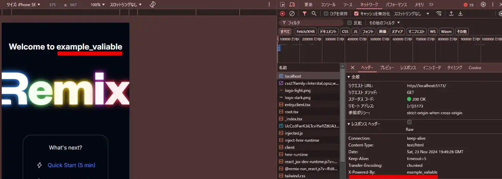
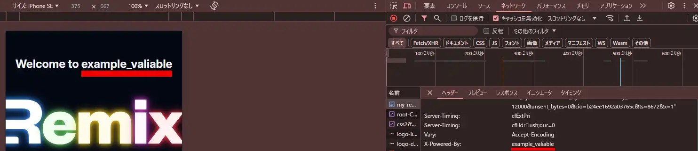
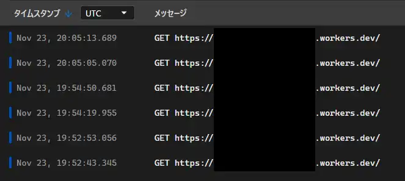

## 概要
Cloudflare WorkersのStatic AssetsやWorkers logsの対応により、Workersで動かしたい事象が増えてきましたね！！  
<ExLinkCard url="https://developers.cloudflare.com/workers/static-assets/" />
<ExLinkCard url="https://developers.cloudflare.com/workers/observability/logs/workers-logs/" />

そして素晴らしいタイミングでWorkersとPages両対応のhono-remix-adapterがHono作者様より作成されました！！！  
<ExLinkCard url="https://github.com/yusukebe/hono-remix-adapter" />

これにより、WorkersでHonoミドルウェアを備えたRemixが簡単に作れて、ログも記録出来るようになりました！！  
今回は早速、Remix on Honoを動かしてみます。  


## hono-remix-adapterの導入
基本はReadmeの通り実施していきます。  

成果物はこちらを参照ください！！  
[https://github.com/sori883/test-hono-remix-adapter](https://github.com/sori883/test-hono-remix-adapter)  

変更したファイル一覧はこちらです  
[https://github.com/sori883/test-hono-remix-adapter/commit/ffda9ac899b74e4bd0f0d36a1380e2a7d2adaef8](https://github.com/sori883/test-hono-remix-adapter/commit/ffda9ac899b74e4bd0f0d36a1380e2a7d2adaef8)  

今回は、Cloudflare公式のRemix on Cloudflare Workersのテンプレートに導入していきます。  
まずは、テンプレートをインストールします。  
```
pnpm create cloudflare@latest my-remix-app --framework=remix --experimental
```

合わせて、今回の主題である「hono-remix-adapter」及び、「hono」、「@hono/vite-dev-server」をインストールします。  
```
pnpm add hono-remix-adapter hono @hono/vite-dev-server
```

vite.config.tsを以下の通り変更しました。  
```ts
import { defineConfig } from "vite";
import {
  vitePlugin as remix,
  cloudflareDevProxyVitePlugin,
} from "@remix-run/dev";
import serverAdapter from "hono-remix-adapter/vite"
import adapter from "@hono/vite-dev-server/cloudflare"
import tsconfigPaths from "vite-tsconfig-paths"
import { getLoadContext } from './load-context'

declare module "@remix-run/cloudflare" {
  interface Future {
    v3_singleFetch: true;
  }
}

export default defineConfig({
  plugins: [
    cloudflareDevProxyVitePlugin(),
    remix({
      future: {
        v3_fetcherPersist: true,
        v3_relativeSplatPath: true,
        v3_throwAbortReason: true,
        v3_singleFetch: true,
        v3_lazyRouteDiscovery: true,
      },
    }),
    serverAdapter({
      adapter,
      getLoadContext,
      entry: "server/index.ts",
    }),
    tsconfigPaths(),
  ],
  ssr: {
    resolve: {
      conditions: ["workerd", "worker", "browser"],
    },
  },
  resolve: {
    mainFields: ["browser", "module", "main"],
  },
  build: {
    minify: true,
  },
});

```

また、load-context.tsは以下の通り変更しました。  
ここのEnvは`codegen`で作成された`.dev.vars`の型です。  
```ts
import type { Context } from "hono";
import type { PlatformProxy } from "wrangler";

type GetLoadContextArgs = {
  request: Request
  context: {
    cloudflare: Omit<PlatformProxy<Env>, "dispose" | "caches" | "cf"> & {
      caches: PlatformProxy<Env>["caches"] | CacheStorage
      cf: Request["cf"]
    }
    hono: {
      context: Context;
    }
  }
}

declare module "@remix-run/cloudflare" {
  interface AppLoadContext extends ReturnType<typeof getLoadContext> {
    // This will merge the result of `getLoadContext` into the `AppLoadContext`
    extra: string
    hono: {
      context: Context;
    }
  }
}

export function getLoadContext({ context }: GetLoadContextArgs) {
  return {
    ...context,
    extra: "stuff",
  };
}
```

次に、server/index.tsにHono Appを作成します。  
動作確認用にPowered Byのヘッダーをつけておきます。   
```ts
// server/index.ts
import { Hono } from "hono"

const app = new Hono<{Bindings: Env}>()

app.use(async (c, next) => {
  await next()
  c.header('X-Powered-By', c.env.EXAMPLE_VARIABLE)
})

export default app
```


最後にworker.tsを作成します。  
```ts
import handle from 'hono-remix-adapter/cloudflare-workers'
import * as build from './build/server'
import { getLoadContext } from './load-context'
import app from './server'

export default handle(build, app, { getLoadContext })
```

また、wrangler.tomlのmainにworker.tsを指定しておきます。  
```toml
#:schema node_modules/wrangler/config-schema.json
name = "my-remix-app"
compatibility_date = "2024-11-12"
main = "./worker.ts"
assets = { directory = "./build/client" }

# Workers Logs
# Docs: https://developers.cloudflare.com/workers/observability/logs/workers-logs/
# Configuration: https://developers.cloudflare.com/workers/observability/logs/workers-logs/#enable-workers-logs
[observability]
enabled = true

[vars]
EXAMPLE_VARIABLE = "example_valiable"
```

## 動作確認
### ローカルで確認してみます
X-Powered-Byヘッダーが設定されていて、Remix側も環境変数取れていい感じですね～。  


### デプロイしてWorkersで確認してみます
ローカルと同様にX-Powered-Byヘッダーが設定されていて、Remix側も環境変数取れていい感じですね～。  


ついでにログもちゃんと記録されてますね～～。  



## 完走の感想
load-context.tsはかなり雰囲気で変更したため、もっといい方法がある可能性大です。  
折角codegenがあるので利用したい！となった結果上記の通りとなりました。  
また`extra: "stuff",`が必要な理由もよくわかってません。。。。誰かおしえてください..  


hono-remix-adapterのコントリビュータの方が教えてくれました！圧倒的感謝です  

<Twitter url="https://x.com/const_myself/status/1861056753288597664?s=46" />


でも、WorkersとPagesが切り替えられるのはよいですね！  
ログやService Bindingsの呼び出し等、どちらか一方にしか実装されていない状況が発生するので、乗り換えるか。。となった時の対応が取れるのは大変ありがたいですね！！！（特に個人開発をしている様な方とかに！！）  
