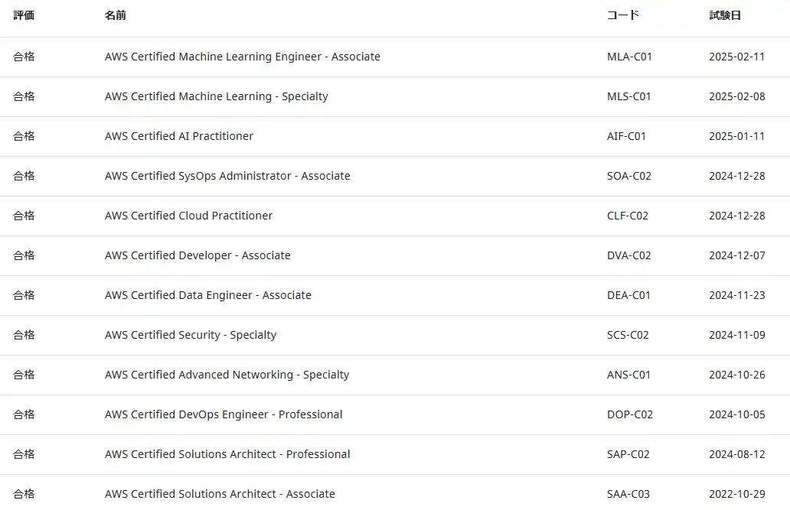

## はじめに
2025年2月11日に現行のAWS認定資格を12種全て取得し、AWS認定全冠を達成しました。 

AWS SAAは2022年に取得済みで、その他は大体2～3週間に1個ペースで取得しました。  

## 全冠を目指した理由
明確に理由はなかったです。  
勉強を始めた当初は、AWS案件にアサインされたしSAPro取得しよう！くらいのテンションでした。   
勉強をしている内に段々楽しくなってDOPを取得したタイミングでどうせならと全冠をめざしました。  

## 認定資格の点数一覧
| 取得順 | 資格名 | 点数 | 合格日 |
| ---- | ---- | ---- | ---- |
| 1 | SAA-C03 | 819 | 2022-10-29 |
| 2 | SAP-C02 | 879 | 2024-08-12 |
| 3 | DOP-C02 | 874 | 2024-10-05 |
| 4 | ANS-C01 | 876 | 2024-10-26 |
| 5 | SCS-C02 | 893 | 2024-11-09 |
| 6 | DEA-C01 | 886 | 2024-11-23 |
| 7 | DVA-C02 | 872 | 2024-12-07 |
| 8 | CLF-C02 | 821 | 2024-12-28 |
| 9 | SOA-C02 | 778 | 2024-12-28 |
| 10 | AIF-C01 | 834 | 2025-01-11 |
| 11 | MLS-C01 | 819 | 2025-02-08 |
| 12 | MLA-C01 | 768 | 2025-02-11 |
