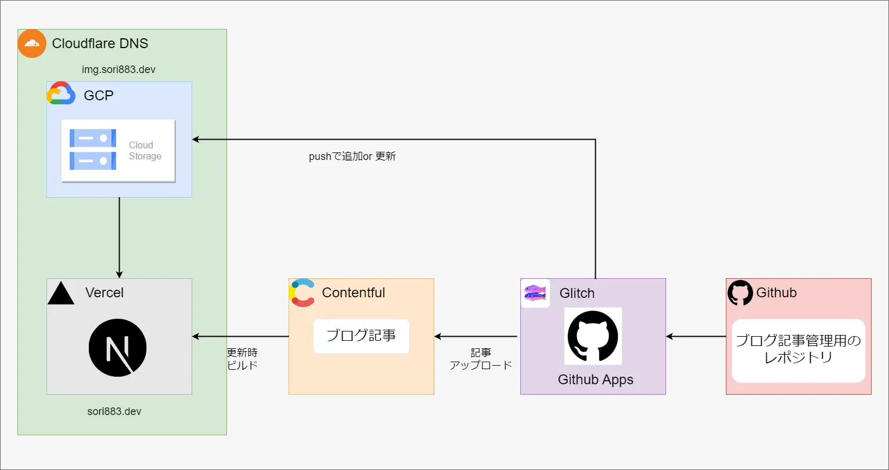
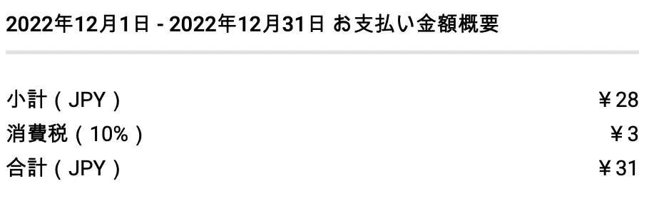

## 技術選定と構成

古来からの言い伝えで雑なアウトプット先としてWordpressブログを使ってましたが、

- 管理画面が使い辛くて記事投稿や管理がめんどくさい
- wordpress独自仕様と戦いながらサイトの体裁を整えるのが辛い
- レンタル鯖高い

あたりの理由からwordpressを脱却してなるべくコストを抑えて、触ってみたかったものを選定作り直しを図りました。

最終的な技術選定は下記です。

- Contentful
- Next.js
- GCS
- Cloudflare DNS
- Github Apps

構成を図にすると画像の通りです。



上記を実現するためのレポジトリが3つありGithubApps以外はmainへのプッシュをトリガーに自動で機能するようになっています。

- [Next.js](https://github.com/sori883/contentfulBlog)
- [GithubApps](https://github.com/sori883/conetentfulBlogApps)
- [記事管理用](https://github.com/sori883/blogContent)

元々、NestJs+Prismaでバックエンドを作ろうと思っていましたが、CloudRunやCloudSQLの費用がどう頑張っても月1000円以上掛かるのと、Next.jsでSGするだけのブログなら無駄がすぎるのでやめました。  
代わりに触ってみたかったヘッドレスCMSを採用してます。

## ContentfulとNext.js

有名どころのヘッドレスCMSから高機能+無料枠が充実しているContentfulを選択しました。  
個人的に嬉しかったのはここらへん。

- レコード数上限が25000
- 3個まで複数環境可
- GraphQL API

このサイトは、Next.jsでConentfulからGraphQLでデータを取得してSSGしています。  
Next.jsからContentfulのコンテンツ取得には、[GraphQL Content API](https://www.contentful.com/developers/docs/references/graphql/)と、Apollo Clientを使用してCodegenで下記の様に、型定義とQueryが自動生成させてます。

1.shemaを取得  
ContentfulのApps > GraphQL PlaygroundのSCHEMAからダウンロード出来たので、そのまま使ってます。  
下記を参考にコマンドラインで取得したかったけど、Apollo Client周りが面倒だったのでやめました。  
[Contentful, Next.js, Apolloで作成したポートフォリオをGithub Pagesに公開したときの備忘録](https://qiita.com/Adacchi3/items/e6d14dda4084f6a88812)

2.Queryを作成  
例として、ページングで使えそうな取得Queryを定義

```GraphQL
query posts($skip: Int, $limit: Int) {
  postsCollection(skip: $skip, limit: $limit){
    items{
      title
      slug
      content
    }
    total
  }
}
```

3.codegen.ymlを作成  
あとは下記の様なcodegen.ymlを作成して、`graphql-codegen --config codegen.yml`を実行するだけで
型定義等が生成されます。

```yml
overwrite: true
schema: "./src/graphql/schema.graphql"
documents:
  - ./src/graphql/queries/**/*.graphql
generates:
  src/graphql/generated.ts:
    plugins:
      - "typescript"
      - "typescript-operations"
      - "typescript-react-apollo"
    config:
      skipTypename: true
      scalars:
        Date: number
```

自動生成された後は、getStaticPropsなどでよしなに使えます。

```js
// 生成されたのは、PostsQuery、PostsQueryVariables、PostsDocument
const { data } = await client.query<PostsQuery, PostsQueryVariables>({
  query: PostsDocument,
  variables: { limit: 20, skip: 0 }
});
```

Codegenを体験すると、自分で書いていた時代には戻れなくなっちゃう。

## ContentfulとGithub Apps

Contentfulにも、Wordpressの様な投稿画面はありますが、

- 記事をGitで管理したい
- 画像はGCSにアップロードしたい
  を叶えるべく、特定レポジトリへのPushをトリガーとするGithub Appsを作成することにしました。

まず、記事(mdファイル)は、Contentfulが用意してくれているコンテンツ管理用の[Content Management API](https://www.contentful.com/developers/docs/references/content-management-api/)を使用してエントリの作成・更新をしています。

この追加・更新についてはドキュメントではざっくりしか触れられておらず、特にEntryLink(References)がある場合のエントリ作成・更新方法がどこに書いてあるのか一生探しました。  
(読み込みが浅いだけかも...?)  
また、タグ周りでfindOrCreateのような動作が必要になりましたが、それも見つからず(恐らく機能自体ない？)自分で実装することになったので、かなりの時間がかかりました。

参考にしたい方がいましたら、汚いコードですが下記を参照ください。  
[https://github.com/sori883/conetentfulBlogApps/blob/main/src/index.ts](https://github.com/sori883/conetentfulBlogApps/blob/main/src/index.ts)

また、画像配信はGCSを利用しています。  
理由としては、Contentfulで画像をアップロードすると1枚につき、無料枠のレコードが1消費されるからです。  
無料枠が25kもあるので要らない気もしましたが、無料枠を越したときに面倒な移行をやるくらいなら最初からGCSを使えば楽だと思い、英断しました。

## 1ヶ月運用してかかった金

GCSだけの利用で税込み31円でした。  
収益0円の雑記としては許容出来るお値段ですね。  


## 今後やりたいこと

OW2をやりながらだいぶ急いで作成したので、手直ししたいところがかなりあります。

- ダークモード対応
- markdownの変換周りで、独自記法を追加したい
- 関連記事の表示
- OGP画像生成
- PageSpeed Insightsの結果を緑色にする
- 日本後、アルファベットともに読みやすいフォントを探したい
- 細かいデザイン修正

他にやりたいこともあるので、ゆっくり余生を過ごすような思いで直して行こうかと思います！
