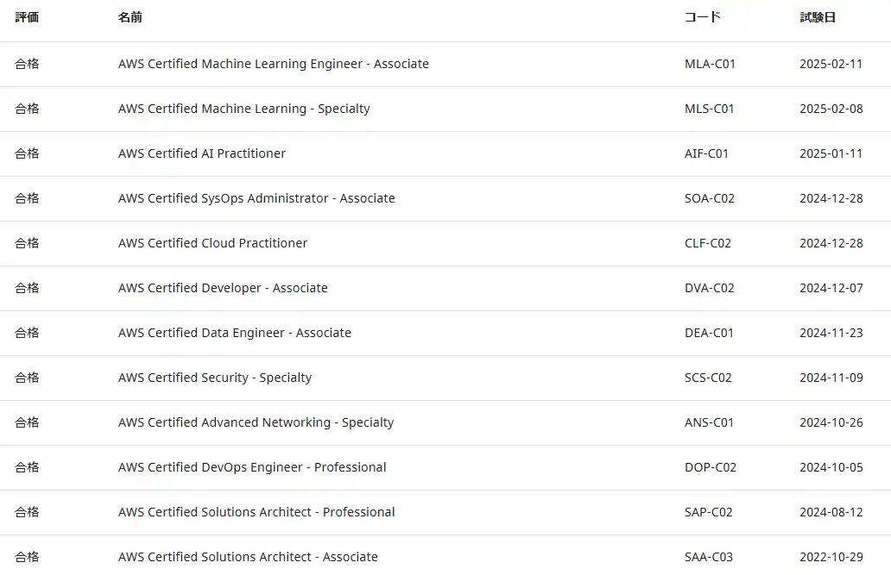

## はじめに
2025年2月11日に現行のAWS認定資格を12種全て取得し、AWS認定全冠を達成しました。  

  

## 受験履歴と結果
点数と受験日です。  
| 取得順 | 資格名 | 点数 | 合格日 |
| ---- | ---- | ---- | ---- |
| 1 | SAA-C03 | 819 | 2022-10-29 |
| 2 | SAP-C02 | 879 | 2024-08-12 |
| 3 | DOP-C02 | 874 | 2024-10-05 |
| 4 | ANS-C01 | 876 | 2024-10-26 |
| 5 | SCS-C02 | 893 | 2024-11-09 |
| 6 | DEA-C01 | 886 | 2024-11-23 |
| 7 | DVA-C02 | 872 | 2024-12-07 |
| 8 | CLF-C02 | 821 | 2024-12-28 |
| 9 | SOA-C02 | 778 | 2024-12-28 |
| 10 | AIF-C01 | 834 | 2025-01-11 |
| 11 | MLS-C01 | 819 | 2025-02-08 |
| 12 | MLA-C01 | 768 | 2025-02-11 |

SAPro、DOPは基礎勉強も含めてに2か月～1か月かけて受験しました。  
その他の試験はPro資格と範囲が重複していたこともあり、3週間程度スパンで、やる気が落ちないようになるはやで受けるようにしてました。  

どうでもいいですが、2024-12-28にCLFとSOA同時受験する前日の忘年会で気付いたら飲みすぎていてマーーーージできつかったです。  
お酒セーブ出来ると思って飲み会翌日に試験予約してる人は希望的観測をやめてリスケしましょう。  

## 全冠を目指した理由
明確な理由はなく、AWS案件にアサインされたから勉強ついでSAPro取得しよう！くらいのテンションでやっていたら、
段々楽しくなってDOPを取得したタイミングでどうせならと全冠をめざしました。  

## 認定資格取得のおすすめロードマップ
AWS認定にはいくつかの技術分野に分かれており、分野ごとに勉強すると簡単なところから順々にステップアップ出来て、モチベーションを保ちやすいです。   
AssociateやProfessionalの括りで勉強すると、「毎回なんも分からん...なんだっけこれ？」から始まるので結構メンタルえぐれます。  

また、SAPは範囲が広いため他の認定資格と出題範囲かなり被ってます。   
SAPの知識があればDevOps系やSpecialtyに向けて取っ掛かりが出来るので、下記のような一番最初にArchitect分野を極めてDevOps等を取得するような順序がおすすめです。   

- Architect系の分野
  - CLF
  - SAA
  - SAP
- DevOps系の分野
  - SOA
  - DVA
  - DOP
- Specialty認定
  - SCS
  - ANS
- AI/ML系の分野
  - DEA
  - AIF
  - MLA
  - MLS

一番最後、AI/ML系の分野（特にMLS）は「これAWSの資格じゃないだろ」と口走るほどAI/ML分野に偏っているので、なるべくなら一番最後にAWS知識が完璧な状態で受けることをおすすめします。   
AWSがよく分からない状態でAI/MLの知識を詰め込もうとすると、破綻して何が分からないのかも分からん状態になります。   

## 勉強方法
### 参考書
基礎を勉強するため、SAAとSAPの時だけ読みました。  
<ExLinkCard title="AWS認定アソシエイト3資格対策～ソリューションアーキテクト、デベロッパー、SysOpsアドミニストレーター～" url="https://www.amazon.co.jp/gp/product/B07TT1N73K/ref=ppx_yo_dt_b_search_asin_title?ie=UTF8&psc=1" />
<ExLinkCard title="AWS認定資格試験テキスト＆問題集　AWS認定ソリューションアーキテクト - プロフェッショナル　改訂第2版" url="https://www.amazon.co.jp/gp/product/B0BTYNHFP5/ref=ppx_yo_dt_b_search_asin_title?ie=UTF8&psc=1" />

### CloudLicense
このサイトのおかげで全冠出来た気がします。  
<ExLinkCard url="https://cloud-license.com/" />

### Udemy
CloudLicenseの補完として使っていました。  
<ExLinkCard title="Udemy" url="https://www.udemy.com/" />

### 気を付けていたこと
解説をしっかり読んで理解するように、Notionに間違えて問題の解説を要約してメモるようにしてました。   
1. Notionにメモらなきゃいけない
2. 解説全部書きたくない
3. メモる文字数少なくするために要約出来るまでちゃんと読む
4. 理解！  
という算段です。  

実際、メモは一度も読み返してませんが2週目以降、案外点数を取れるようになってます。  
人間ってすごいですね。  

## AWS認定資格を全冠して良かったこと
### AWSを体系的に学べた
認定試験でひたすらベストプラクティスを問われたので、自然と各サービスの使い方、連携方法が身に付きました。  
特に一番嬉しいのは、正解例としてこのユースケースの場合はこれがベストプラクティスだよと提示してくれる点。  
独学でやると「これでいいんだろうか...」とかずっと不安だし、アンチパターンになってるとかありがち。   

### アピールポイントを手に入れた 
今までそんな自分の一面をアピールする材料がなかったので、いいアピールポイントになりました。 
「AWS認定資格を自費で全冠してます！」 って話題から、技術的な話に繋げられるので、面接や雑談で話題デッキとして活躍してくれました。  

### AWSコミュニティの素晴らしさに気づいた
これは直接認定と関係ないですが、AWSコミュニティの素晴らしさとモチベーション維持、学習の助けになりました。       
資格勉強や業務で分からないことをググると大抵、有志の書いた解説ブログがヒットしますし、クオリティもとても高いです。  
有志で勉強会を運営してたり、会社間の垣根を越えて技術交換しあってたり。  
多くの方がAWSを楽しんで、AWSの発展に貢献し、自分自身もより高みをめざす様がスゲー良いコミュニティだな〜と思いました。    

私自身も手軽に出来る技術的アウトプットからでも少しずつ貢献していきたい所存です。  

## AWS認定資格を全冠で辛かったこと
### お金かかりすぎ！
会社に受験料金補助や報奨金制度がなく、全て自費なので家計が苦しかったです。  
因みにSAProを受けた時は受験料4万円払ったので、手が震えました。  
「これ落ちたら4万円が((((;Д;))))ガクガクブルブル」  

計算してみたら結構えぐい。  
| 項目 | 金額 |
| ---- | ---- |
| 受験料 | 214,500円 |
| 教材 | 40,794円 |
| 合計 | 255,294円 |

その分、絶対に一発で受かる！って気合は入りますけどね。  

## 終わりに
12冠は達成しましたが、APN所属じゃないのでAWS All Certifications Engineersにはなれません。  
結構悲しいんですけど..諦めるか、転職するか、合同会社をつくるか.。  
