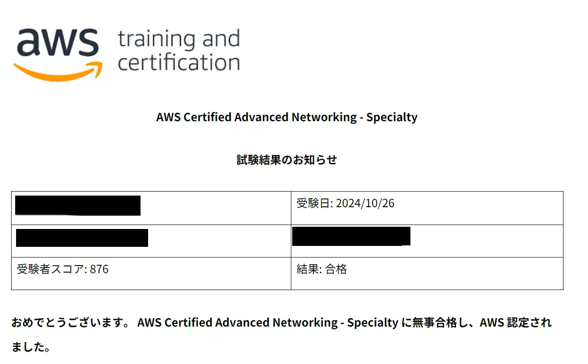
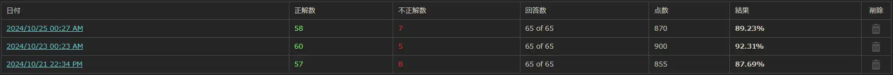

## 概要
[AWS DOPの合格](https://sori883.dev/posts/aws_dop_c02_passrecord/)から3週間後、「AWS Certified Advanced Networking - Specialty(ANS-C01)」に合格しました。  
合格体験記として、ANSの所感をまとめます。  

## 勉強の流れ
### 勉強時間
DOP合格から3週間勉強して合格しました。  
勉強時間は毎日2時間、3週間で50時間程度です。  

### 勉強方法
教材.1 CloudLicense（3週間）
CloudLicenseのみで勉強しました。  
<ExLinkCard url="https://cloud-license.com/" />

勉強内容は、他のAWS試験と同様、⓵演習問題を一通り解く→②間違えた問題はだけを解く→③②で間違えた問題だけを再度解くを繰り返し、最終的に全て正解するまで演習問題を行いました。    
その後は模擬問題解く→復習するを1日サイクルで実施してました。  
受験直前の点数は以下の通りで、おおよそ本番と同じくらいでした。  

## 本番試験
難易度はCloudLicenseより一歩踏み込んだ内容が多く、更に知らないサービスやオプションを含む問題がかなり出題されたので、完全に落ちたと思いました。    

特に、ネットワーク周りのサービスは調べておいて良かったと思ってます。    
- Direct Connect
- Route 53
- TGW
  - ルーティング設定
- WAN
など。  

また、SAP等で出題された部分も改めて復習しておいて良かったです。    
- ALB、NLB
- Global Acceralator
など。  

DOPと同様、SAPの知識にかなり助けられた部分がありました。  
Route 53とかほぼSAPと一緒です。  

## 完走の感想
3週間と短い期間で挑戦しましたが、無事合格出来ました。  
噂ではSAPより難しい...なんて話を聞いてましたが、SAP合格者であれば比較的楽に合格できると可能性が高いです。    
ネットワーク知識も改めて学びなおす必要ないかもです。  

次はSCS、３～４週間で取れたらいいなぁ。  