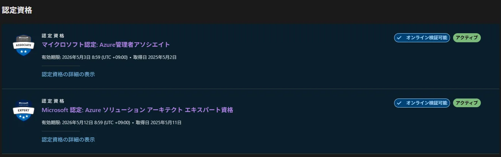

## 概要
Azure全く触ったことない状態から、2025年の5月2日にAZ-104、5月11日にAZ-305を取得しました。  
この記事では、2つの資格の勉強方法を備忘録的に残します。  

  

## AZ-104の勉強方法
Udemyの問題集一本で行いました。  
<ExLinkCard url="https://www.udemy.com/course/30az-104-microsoft-azure-administrator240/?srsltid=AfmBOopj564VVna_JGsKWugX7GgEhz5Cgm__dt7cb6dpDtYjU-0XPJ_g" title="受講生30万講師のAZ-104: Microsoft Azure Administrator模擬試験問題集（400問）" />

Azure独自のストレージアカウント、Entra ID等の知識とインフラの浅く広い知識が求められるので、技術職でない方には難しいと感じます。  
私自身、1回目は不合格、2回目で合格した時も750点前後だったのでAZ-900から始めるのも全然アリです。  

## AZ-305の勉強方法
Udemyの問題集を日本買いました。
<ExLinkCard url="https://www.udemy.com/course/microsoft-azure-az305-exam/?srsltid=AfmBOopTpBaDbbT7GJcV8jB80iVZFumNfuOrcYKZ3l2U2xsqJnL8KRVp&couponCode=25BBPMXPLOYTRMT" title="最短で合格！Azure Solutions Architect Expert AZ-305 試験対策問題集" />
<ExLinkCard url="https://www.udemy.com/course/az-305-azure-architect/?srsltid=AfmBOoq0LqdB5xcVTi9LnWf6S9fkPmLaz0_JiUgTTScXCtqkabQJbbkb&couponCode=25BBPMXPLOYTRMT" title="【日本語版】AZ-305 Azure Solutions Architect Expert オリジナル試験問題" />

また、こちらの記事に書いてあるJPN試験なるものも半分くらいやりました。  
<ExLinkCard url="https://zenn.dev/murakami_koki/articles/e404cb8aa8995b" title="【必読】Azureエンジニアが教える！AZ−104とAZ−305にほぼ合格できる勉強方法" />

AZ-104でかなり痛い目をみて身構えていたのですが、全然AZ-305の方が簡単でした。  
AZ-104と範囲が重複している部分が大半で、AZ-305独自範囲が覚えやすいからだと感じています。    
実際、1週間程度の勉強でUdemyを全部90点以上取れてました。  

## Microsoft Learnは絶対使う
試験中はMicrosoft Learnという公式カンペが使いたい放題です。  
試験で素早く必要な情報を探し出せるように事前練習しておくことを強くおすすめします。  

例えばこんなドキュメントが試験中に見られます。もう答えじゃん。  
- [Azure 組み込みロール](https://learn.microsoft.com/ja-jp/azure/role-based-access-control/built-in-roles)
- [ストレージ アカウントの概要](https://learn.microsoft.com/ja-jp/azure/storage/common/storage-account-overview?toc=%2Fazure%2Fstorage%2Fblobs%2Ftoc.json&bc=%2Fazure%2Fstorage%2Fblobs%2Fbreadcrumb%2Ftoc.json)
- [Azure Load Balancer の SKU](https://learn.microsoft.com/ja-jp/azure/load-balancer/skus)

## Azureを実際に触ってみる
試験勉強していて、「〇〇ブレードの〇〇」って問題がどうしても覚えられなくて、Azure PortalでEntra IDをずっと触ってました。    
文章で覚えるより画面として覚えた方が定着率いいのです。Entra IDとかほんと。  

初めてAzureを使う場合は$200のクレジットが貰えるので、余程のことない限り無料で使える気がします。  
<ExLinkCard url="https://azure.microsoft.com/ja-jp/pricing/purchase-options/azure-account/" title="Microsoft Azure" />

## あとがき
次はAZ-400！と行きたいですが、お金がないです。  
受験料＋教材費で￥81,790が飛んでいったので、Azureは一旦休憩します。  
その間兼ねてから興味あったセキスペを勉強することにしました。受験料も安いですし。  
