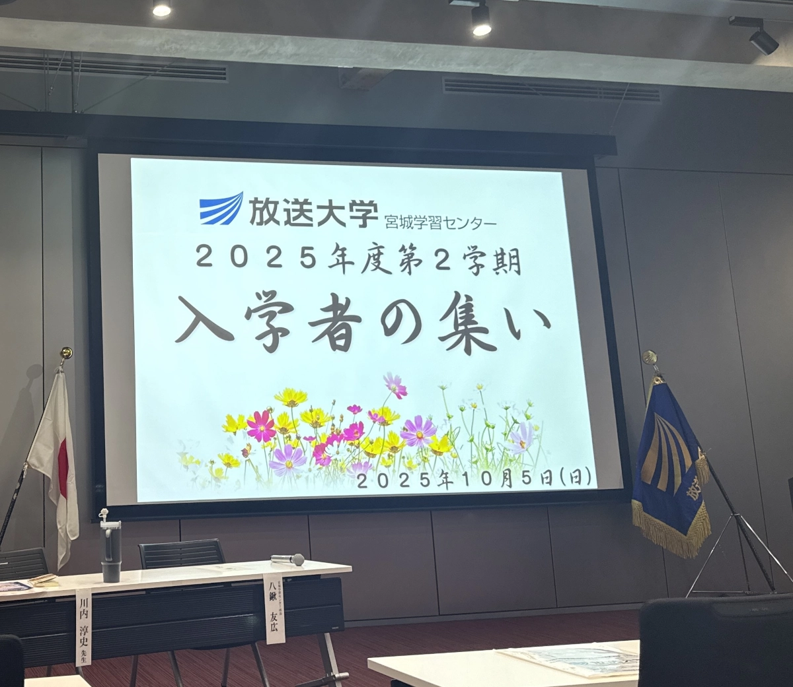
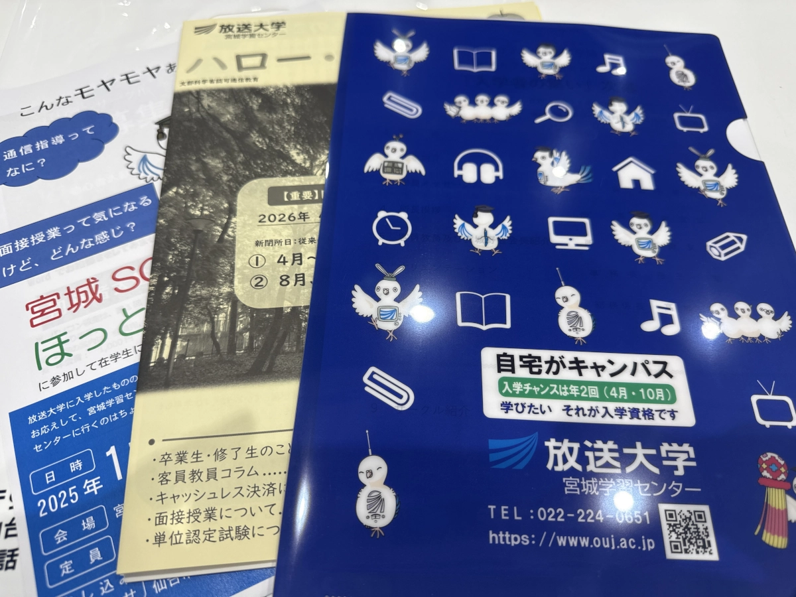
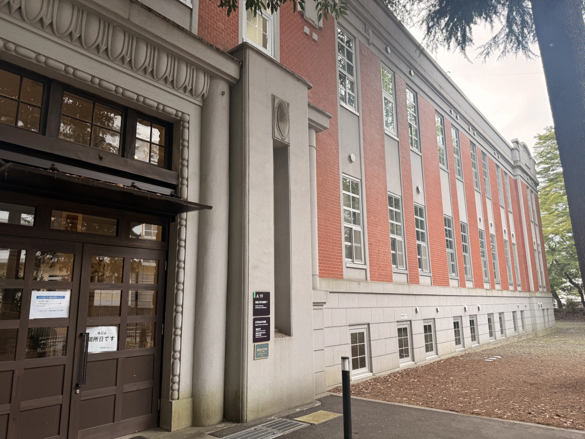
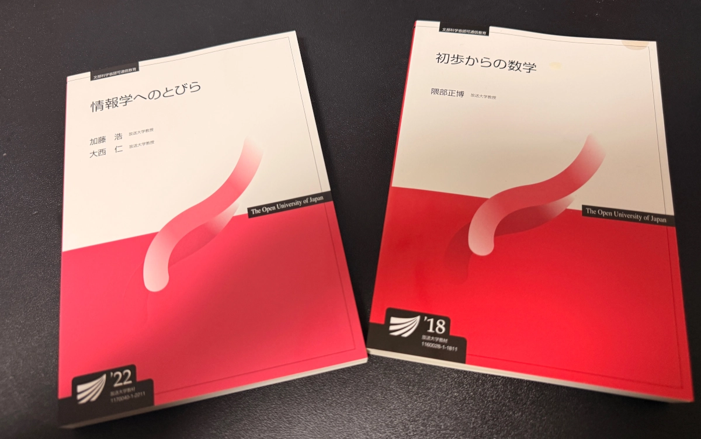

こんにちは〜。  
sorinaji[@sori883](https://x.com/sori883)です。  

知的好奇心と学割を求めて、2025年第2学期に放送大学へ入学しました。  
今回の記事は「入学者の集い」に行ってきたので、参加レポートです。  
今後、放送大学に入学される方が「入学者の集い」の雰囲気を少しでもつかんでいただければと思います！

## 入学者の集い会場風景
「入学者の集い」の参加案内は、入学の約2週間前にハガキで出席案内が送られてきます。  
なお、参加は任意となります。  

  

私が参加した宮城県の学習センターでは、老若男女50人程度が参加していました。  
皆さん服装はパーカーやシャツといったカジュアルな格好で、ほとんどソロで参加しているようでした。  

  

入学者の集いでは、学生証をはじめ、施設やWAKABAの使い方、授業の進め方の冊子が配られ、
おおよそ以下のようなタイムスケジュールで説明がありました。  
1. 学歌紹介
1. 学長メッセージ
1. 所長メッセージ
1. 教員・職員紹介
1. オリエンテーション（授業の進め方、システムの使い方）
1. サークル紹介

大体1.5時間程度でした。  

終わった後は解散になります。  
サークル代表や、放送大学の職員の方がいらっしゃるので、サークル加入やオリエンテーションの不明点を確認可能です。  

## 学習センターに入ろうと思ったが..
どうせなら、学習センターを見学して帰ろうかな〜と思って立ち寄りましたが、閉庁日でした...。  
  

「入学者の集いが開催されているため、閉庁日になります」と記載があったため、入学者の集いとは別日に行かないと入れないのかもしれません。  

## さいごに
「入学者の集い」は学生証をもらう良いタイミングにもなりますし、モチベーション上げるきっかけにもなります！  
また、オフラインだとハードルが高いという方でも、グループチャットやSNSで使ってオンライン交流できるサークルも多数あるようです。  

これから放送大学に入学される方が気軽に交流を始めるきっかけになれば幸いです😄  
  
