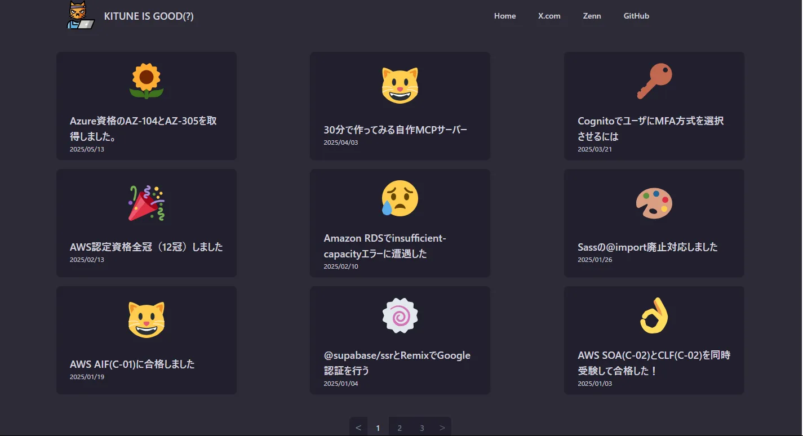
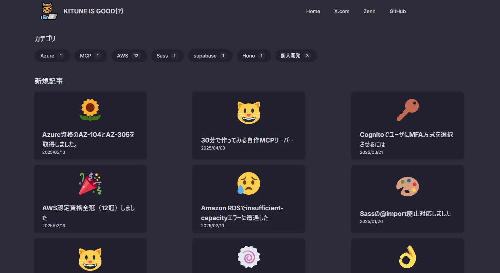

## はじめに
Clude Codeを導入して、お試しでこのブログを改修してみました。  
やったことはこれら。  
- WSLにClaude Codeインストール
- MCPサーバーの追加
- Claude Codeの設定
- メモリを管理する
- スラッシュコマンド導入
- scssをcssに書き直し
- カテゴリ一覧ページ作成

## Claude Codeの導入
Claude Code導入のPRはここです。  
<ExLinkCard url="https://github.com/sori883/contentfulBlog/pull/278" />


Claude CodeはWindowsに導入出来ないので、WSLを使います。  

以下を参考に設定しました。  
<ExLinkCard url="https://zenn.dev/acntechjp/articles/eb5d6c8e71bfb9" />

初めてWSLを使用する場合、デフォルトだと固まるので、メモリ等の調整をおすすめします。  
`C:\Users\USERNAME\.wslconfig`でメモリを3GBくらいにしたら落ちつきました。  
```
[wsl2]
memory=3GB
swap=3GB
```


取り敢えず動作確認をしてみる。Claude Codeのクイックスタートを見てみると、最初にソースコードを理解させるといいらしい。  
<ExLinkCard url="https://docs.anthropic.com/ja/docs/claude-code/quickstart" title="クイックスタート" />

```
$ claude

> このpnpm workspaceの中に何がありますか？リスト形式で教えてください。

● このpnpm workspaceには以下のものがあります：

  Apps

  - api - Hono APIサーバー（Cloudflare Workers用）
  - blog - Honoフレームワークを使用したブログアプリケーション

  Tooling

  - eslint - ESLint設定パッケージ
  - github - GitHub Actions設定
  - prettier - Prettier設定パッケージ
  - tailwind - Tailwind CSS設定パッケージ
  - typescript - TypeScript設定パッケージ

  設定ファイル

  - package.json（ルート）
  - pnpm-workspace.yaml
  - turbo.json
  - contentfulBlog.code-workspace

ブログ記事は apps/blog/app/routes/posts/ に各記事フォルダとして格納されており、AWS認定試験やAzure認定試験の合格記録、技術記事などが含まれています。
```

動作確認的には問題なさそう。  

## MCPサーバーの追加
`./mcp.json`を自動で読み込みしてくれる。とかいてあるが実際は読み込んでくれてない。  
Claude Code起動時に`claude --mcp-config ./mcp.json`とする必要がある。  
<ExLinkCard url="https://docs.anthropic.com/ja/docs/claude-code/mcp" title="Model Context Protocol (MCP)" />


取り敢えず`./mcp.json`にAWSのMCPを追加してみる。  
```json
{
  "mcpServers": {
    "awslabs.aws-documentation-mcp-server": {
      "command": "uvx",
      "args": [
          "--from",
          "awslabs-aws-documentation-mcp-server",
          "awslabs.aws-documentation-mcp-server.exe"
      ],
      "env": {
          "FASTMCP_LOG_LEVEL": "ERROR"
      },
      "disabled": false,
      "autoApprove": []
    }
  }
}
```

動作確認してみます。  
```
> awsのMCPを使って簡単にlambdaについて調べて。

● AWS MCPを使ってLambdaについて調べます。

● Read(mcp.json)
  ⎿  Read 17 lines (ctrl+r to expand)

● AWS MCPサーバーが設定されています。これを使ってLambdaについて調べてみます。

● Task(AWS Lambda documentation search)
  ⎿  Done (4 tool uses · 15.7k tokens · 2m 7.3s)

● AWS Lambdaについて調べました。

  Lambda概要:
  - サーバーレスコンピュートサービス
  - イベント駆動でコード実行、サーバー管理不要
  - 自動スケーリング、複数言語対応

  主な特徴:
  - ミリ秒単位の従量課金
  - 月100万リクエスト無料
  - CloudWatch統合監視
  - コンテナイメージ対応

  用途例:
  - Web/モバイルAPIバックエンド
  - リアルタイムデータ処理
  - IoTバックエンド
  - AI/ML推論

  設定済みのMCPサーバーでより詳細な情報も取得できます。
```

AWS MCP使って調べてくれてますね。  
最終的には、下記2つを有効化しておいた。  
<ExLinkCard url="https://github.com/mizchi/lsmcp" />
<ExLinkCard url="https://github.com/mizchi/readability" />

```json
{
  "mcpServers": {
    "lsmcp": {
      "command": "npx",
      "args": ["-y", "@mizchi/lsmcp", "--language", "typescript"]
    },
    "readability": {
      "command": "npx",
      "args": ["-y", "@mizchi/readability", "--mcp"]
    }
  }
}
```

有効化されてるMCPを`/mcp`で確認。  
```
$ claude --mcp-config ./mcp.json
>  /mcp
│ Manage MCP servers
│ ❯ 1. lsmcp        ✔ connected · Enter to view details
│   2. readability  ✔ connected · Enter to view details
```

## Claude Codeの設定
`.claude/setting.json`に設定ファイルを作ることでパーミッションを設定できる。  
<ExLinkCard url="https://docs.anthropic.com/ja/docs/claude-code/settings" title="Claude Code設定" />

以下を参考に、MCP等の実行を許可した。  
<ExLinkCard url="https://github.com/mizchi/lsmcp/blob/main/.claude/settings.json" />
```json
{
  "permissions": {
    "allow": [
      "Bash(ls:*)",
      "Bash(grep:*)",
      "mcp__readability__read_url_content_as_markdown",
      // lsmcp tools (TypeScript via Compiler API)
      "mcp__lsmcp__*",
      // Or specific tools
      "mcp__lsmcp__rename_symbol",
      "mcp__lsmcp__move_file",
      // TypeScript-specific server
      "mcp__typescript__*",
      // Language-specific tools
    ],
    "deny": [
      "Bash(npm:*)"
    ]
  }
}
```

## メモリを管理
メモリ管理とは、`./CLAUDE.md`にシステムプロンプトを書いておける機能のよう。 
<ExLinkCard url="https://docs.anthropic.com/ja/docs/claude-code/memory" title="Claudeのメモリを管理する" />


こちらを参考にしつつ、Claude Codeにレビューしてもらった。  
<ExLinkCard url="https://github.com/mizchi/lsmcp/blob/main/CLAUDE.md" />

```
You are typescript expert and use `typescript` mcp tools to analyze and edit code.

Given a URL, use read_url_content_as_markdown and summary contents

## CRITICAL: Tool Usage Priority for Refactoring

**When performing refactoring operations (rename, move, etc.) on TypeScript/JavaScript code, ALWAYS use typescript MCP tools (`mcp__typescript_*`) instead of the default Edit/Write tools.**

Specifically for refactoring:

- For renaming symbols: ALWAYS use `mcp__typescript__rename_symbol` instead of Edit/Write
- For moving files: ALWAYS use `mcp__typescript__move_file` instead of Bash(mv) or Write
- For moving directories: ALWAYS use `mcp__typescript__move_directory` instead of Bash(mv)
- For finding references: ALWAYS use `mcp__typescript__find_references` instead of Grep/Bash(grep)
- For type analysis: ALWAYS use `mcp__typescript__get_type_*` tools

**NEVER use Edit, MultiEdit, or Write tools for TypeScript refactoring operations that have a corresponding mcp\__typescript_\* tool.**


## Development Stack

- pnpm
- typescript

## Code Modification Workflow

When modifying code in this project:

### 1. Development Commands
\```
# Type checking
pnpm typecheck

# Linting
pnpm lint
\```

### 3. Code Quality Checks
Before committing, always run:
1. `pnpm typecheck` - Ensure no TypeScript errors
2. `pnpm lint` - Check for linting issues

### 4. Refactoring Guidelines
- Use TypeScript MCP tools for semantic refactoring
- Follow existing patterns in the codebase

## Directory Patterns

\```
  apps/               # Application directory
    api/              # Hono API server for Cloudflare Workers
      src/            # API source code
        router/       # API route handlers (ogp, toc, twemoji)
        usecase/      # Business logic layer
      wrangler.toml   # Cloudflare Workers configuration
    blog/             # Hono + React blog application
      app/            # Blog application source
        components/   # React components
          domain/     # Domain-specific components
          elements/   # UI elements (header, footer, pagination)
          layouts/    # Layout components
          markdown/   # MDX custom components
          svg/        # SVG components
        css/          # SCSS stylesheets
        mdx/          # MDX configuration and utilities
        routes/       # File-based routing (pages and posts)
          posts/      # Blog post MDX files with assets
        utils/        # Utility functions
      public/         # Static assets
      dist/           # Build output directory

  tooling/            # Shared development tooling
    eslint/           # ESLint configuration packages
    github/           # GitHub Actions setup
    prettier/         # Prettier configuration
    tailwind/         # Tailwind CSS configuration
    typescript/       # TypeScript configuration

  node_modules/       # Root dependencies
  pnpm-workspace.yaml # PNPM workspace configuration
  turbo.json          # Turborepo configuration
---
\```

## Architecture Overview

### MCP Client Configuration
This project uses external MCP servers via mcp.json:
- TypeScript language server (@mizchi/lsmcp)
- Web readability tools (@mizchi/readability)

### Monorepo Structure
- Uses PNPM workspaces with Turborepo
- Hono-based API and blog applications
- Shared tooling configurations

### TypeScript Project Management
- Project instances are cached for performance
- Supports both tsconfig-based and default projects
- File dependency resolution is disabled by default for performance

```

使用して感じたが、自分の色にかなり改善の余地があり。  
特に`Code Modification Workflow`あたりAI云々というより、このレポジトリにCode Modification Workflowを機械的に出来る仕組みが備わっていない。  
品質担保のために、何をするか、またその仕組みの実装からする必要あるなと反省。  

## カスタムスラッシュコマンド導入
`.claude\commands`にカスタムスラッシュコマンドを作成することが出来る。  
<ExLinkCard url="https://docs.anthropic.com/ja/docs/claude-code/slash-commands" title="スラッシュコマンド" />

`Orchestaror`とgemini-search`を導入した。  
<ExLinkCard url="https://zenn.dev/mizchi/articles/claude-code-orchestrator" />
<ExLinkCard url="https://zenn.dev/mizchi/articles/gemini-cli-for-google-search" />

```
> /gemini-search "仙台の今の天気は？"

● Task(Google search for Sendai weather)
  ⎿  Done (1 tool use · 11.7k tokens · 37.4s)

● 仙台の現在の天気は曇りで、気温は約25.2°C、湿度は81%です。
```
Yahoo天気の通りでした。  


取り敢えず、導入はここまでで、次は改修をしてみます。  

## このサイトを改修してみる
改修したPRはここです。  
<ExLinkCard url="https://github.com/sori883/contentfulBlog/pull/292" />

### SCSSをCSSに書きかえてみる
兼ねてからSCSSを読み込めない事象が発生しており、いっそのことCSSに書き換えをします。  

ベストプラクティスによると、リサーチ、計画、実装、コミットのフローが推奨されているようです。  
<ExLinkCard url="https://www.anthropic.com/engineering/claude-code-best-practices" title="Claude Code: Best practices for agentic coding" />


まずは、調査をして貰います。   
```
> index.scssと、その関連ファイルを見つけてリスト形式で表示してください。

 index.scss関連ファイル一覧:

  メインファイル

  1. /mnt/c/Users/const/misaki/contentfulBlog/apps/blog/app/css/index.scss -
  メインエントリポイント

  関連SCSSファイル

  2. /mnt/c/Users/const/misaki/contentfulBlog/apps/blog/app/css/_content.scss -
  コンテンツスタイリング
  3. /mnt/c/Users/const/misaki/contentfulBlog/apps/blog/app/css/_embed.scss -
  埋め込みコンテンツスタイリング
  4. /mnt/c/Users/const/misaki/contentfulBlog/apps/blog/app/css/_highlight.scss -      
  コードハイライト
  5. /mnt/c/Users/const/misaki/contentfulBlog/apps/blog/app/css/_variables.scss -      
  SCSS変数とミックスイン
  6. /mnt/c/Users/const/misaki/contentfulBlog/apps/blog/app/css/tailwind.css -
  Tailwind CSS

  ビルド済みファイル

  7. /mnt/c/Users/const/misaki/contentfulBlog/apps/blog/dist/static/index-DsRaTdRJ     
  .css - コンパイル済みCSS
  8. /mnt/c/Users/const/misaki/contentfulBlog/apps/blog/dist/static/tailwind-VvIjG     
  P7g.css - コンパイル済みTailwind CSS

```

Tailwindcssとビルド済みファイルも関連ファイルと認識しているので、訂正しつつ書き換えて貰います。

```
> 関連ファイルは以下のファイルで、Tailwindcssとビルド済みファイルは関連ファイルではありません。
1. /mnt/c/Users/const/misaki/contentfulBlog/apps/blog/app/css/index.scss
2. /mnt/c/Users/const/misaki/contentfulBlog/apps/blog/app/css/_content.scss
3. /mnt/c/Users/const/misaki/contentfulBlog/apps/blog/app/css/_embed.scss
4. /mnt/c/Users/const/misaki/contentfulBlog/apps/blog/app/css/_highlight.scss
5. /mnt/c/Users/const/misaki/contentfulBlog/apps/blog/app/css/_variables.scss

scssを使用したくないので、cssに書きかえて欲しいです。条件は以下の通りです。
1. 同等の機能を満たすこと。
2. 人間が読めるように可読性を担保し、コメントを削除しないこと。
3. コメントは日本語で記載すること。
4. ファイル数は1ファイルとし、main.cssという名前にすること。

Update Todos
  ⎿  ☒ Read all SCSS files to understand structure and variables
     ☒ Convert SCSS to CSS while preserving functionality and comments
     ☐ Create main.css file combining all styles
     ☐ Update vite.config.ts to use main.css instead of index.scss
     ☐ Run typecheck and lint to verify changes

 --- 長いので省略

```

終わりです。  
無事に書き換えられて、CSSだけじゃなくて指示していなかったSCSSの読み込み部分も良しなに変えてくれてました。  

### カテゴリ一覧ページ作成
いつかやろうと思っていた記事のカテゴリ一覧を作って貰うことにしました。  
改修前はこの状態です。  
  

例に漏れず、まずは調査からして貰います。  

```
> postsのカテゴリをリストにしてください

● ブログ投稿のカテゴリ一覧：

  1. AWS (12投稿)
  2. 個人開発 (3投稿)
  3. Azure (1投稿)
  4. MCP (1投稿)
  5. Sass (1投稿)
  6. hono (1投稿)
  7. supabase (1投稿)

  全20投稿でAWSが最多カテゴリです。
```

次に実装計画をしてもらいます。  

```
> トップページでカテゴリ一覧でも記事を表示できるようにしたいです。
  まずは何をするべきか計画を練りましょう。現状調査を行って何を変更すればいいか計画してください

  実装計画

  必要な変更点

  1. トップページにカテゴリフィルター追加
    - カテゴリ選択UI（プルダウンまたはタブ）
    - 「全て」オプション追加
  2. 状態管理
    - 選択カテゴリの状態管理
    - URLパラメータ連携（?category=aws）
  3. 記事表示ロジック更新
    - 選択カテゴリに応じた記事フィルタリング
    - ページング対応
  4. UIコンポーネント
    - CategoryFilterコンポーネント作成
    - 既存のPaginationとの連携
```

次に実装して貰います。

```
> まずは変更点1から実装してください。

  -- 長いので省略。変更点1~4を様子見つつ1個1個指示した。

```


実装後のトップページは以下の通りです。  
  

PR後に、SSGでページ見られない、ページネーション実装されてない等の抜け漏れバグがありましたが、バグ修正も含めてコードを1文字も書かず改修が完了しました。  


## さいごに
9割mizchi氏をパクっただけ。Claude Codeの情報源はほぼ彼のX。  

実際に使ってみると、ソースコードを生成するのも勿論ですが、ソースコードの調査がかなり良いと思っていています。  
自分が別のタスクをしている間、Claude Codeが並列で黙々と単一タスク消化してくれるのがかなり強い。  

ただし、Claude Codeに調査、計画、実装の複数タスクを含むワークフローをオーケストレーションにはかなり大変で、ほぼ意図しない行動や成果物が出来上がる。  
「Claudeと寝て一線を越える」ためには、品質を担保する仕組みを作り、人間が適切なコンテキストで、適切な指示する必要がある。辛い。  

取り敢えず、今回はProプランかつ`Sonnet 4`を使用しているので、次はMax契約して`Opus 4`でツールとかアプリを何かしら作ってみたいなぁ。  
